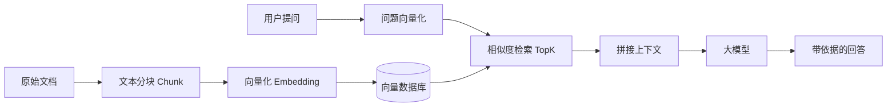
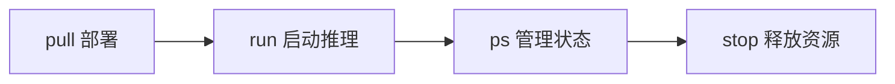
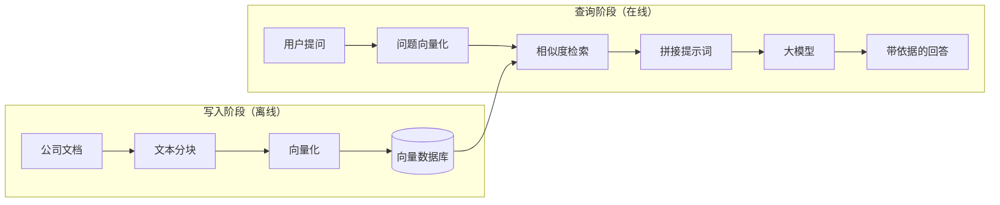

# 大模型技术栈全解析：AI 全栈开发入门指南

> 这篇文章写给想做 AI 方向的前端/后端程序员，也适合零基础入行。内容分四部分：**技术栈全景**、**模型部署**、**模型调优**、**RAG 原理**。全程零基础讲解，跟着做就能跑通。

## 一、大模型技术栈全景

最近总有人传播"AI 会替代程序员"的焦虑。**AI 确实在改变前端领域，但随之而来的是大量新的岗位**——AI 前端、AI Agent 开发、AI 应用开发。与其焦虑，不如看看大厂对这类岗位的技能要求，老老实实补齐。

### 1. 基础核心（程序员的根）

不管做前端、后端还是大模型，这几样是**根基**：

- 数据结构与算法
- 计算机网络
- 操作系统

它们锻炼的是你最重要的能力：**逻辑思维能力、分析问题和解决问题的能力**。这不是能速成的，需要长期沉淀，但一定是核心。

### 2. 前端核心

做 AI 大前端，前端基本功一个都不能少：

| 方向 | 技术 | 说明 |
| --- | --- | --- |
| 框架 | React 18+、Vue 3 | 二选一熟练即可 |
| 状态管理 | Zustand / Jotai / Pinia | 新项目推荐前者，老项目 Vuex |
| 跨端 | Electron、Tauri 2 | Tauri 更轻量、更安全、打包更小 |
| UI | shadcn/ui、Tailwind CSS、UnoCSS | 目前 AI 趋势下的推荐组合 |
| 工程化 | pnpm、Monorepo | 多包管理方案 |
| 构建 | Vite（推荐）、Webpack、Rollup、esbuild | 字节的 Rspack 也可关注 |

### 3. 后端核心

| 方向 | 技术 | 说明 |
| --- | --- | --- |
| SSR 框架 | Next.js（React）、Nuxt.js（Vue） | 服务端渲染 |
| Node 框架 | NestJS（推荐）、Express、Koa | NestJS 生态最全 |
| 数据库 | PostgreSQL | 配合 ORM：Prisma（推荐）、TypeORM |
| 接口规范 | RESTful API | GraphQL、gRPC 等了解即可 |
| 认证 | JWT（核心）、OAuth2.0 | 认证授权方案 |

[NestJS](https://nestjs.com/) 生态非常成熟，包含了后端开发的所有点：Controller、Model、拦截器、数据库、队列、日志、文件上传、认证（JWT）、GraphQL、微服务、中间件（Redis、MQ、Kafka、gRPC）等等。

数据库方面，[Supabase](https://supabase.com/) 可以理解为 PostgreSQL 的低代码平台，配合做用户登录认证、OAuth 第三方授权很方便。

### 4. AI 应用开发（最关键）

我们不是去研究大模型本身，而是**用**它做应用：

| 方向 | 技术 | 说明 |
| --- | --- | --- |
| 编排能力（最核心） | LangChain、LangGraph | 链式调用、图调用 |
| RAG 知识库检索 | ChromaDB、Milvus | 向量数据库 |
| 模型部署（最核心） | Ollama + Qwen | 本地部署 |
| 模型微调 | Qwen 微调教程 | 进阶 |

::: warning 别搞错重点
AI 应用开发**不是调一下大模型接口就完事**。核心是**编排能力**（链式调用、图调用）和**流式输出**（打字机效果），以及 RAG 检索增强、模型本地部署这些实战能力。
:::

下面这张图是完整的 RAG 流程总览，后面会详细讲：



### 5. 了解概念（面试会问）

不需要精通，但要能说出概念：

- 机器学习基础
- 深度学习基础
- 自然语言处理（NLP）基础
- 计算机视觉基础
- 大模型应用开发：Prompt Engineering（提示词工程）、模型微调与定制化、模型部署与优化

### 6. 工程化 & DevOps

- **版本控制**：Git、GitHub、GitLab
- **工程化**：pnpm + Monorepo
- **CI/CD**：GitHub Actions、GitLab CI、Jenkins
- **容器化**：Docker、Docker Compose、Kubernetes（k8s）、K3s、Minikube

### 7. 为什么对前端特别友好？

看 [LangChain](https://www.langchain.com/) 官网——大模型框架基本只有两类语言：**Python 和 TypeScript**。


没有 Java、没有 Go。对前端来说，TypeScript 无缝衔接，**不需要额外学 Python** 就能做大模型应用开发。这是前端转 AI 的巨大优势。

::: tip 核心结论
学技能按上面的路径走，方向不会偏。**不要被制造焦虑的言论带偏**——90% 的人在焦虑，只有 10% 的人在努力。
:::

## 二、基于 Ollama 部署模型

传统"调个接口"太低级了。真正的 AI 应用开发，要会**本地部署模型**。

### 1. 安装 Ollama

[Ollama](https://ollama.com/) 是目前业界最流行的本地模型运行工具。


直接下载对应系统的安装包即可，也可以用命令行安装：

```shell
curl -fsSL https://ollama.com/install.sh | sh
```


验证是否安装成功：

```shell
ollama --version
# Warning: could not connect to a running Ollama instance
# Warning: client version is 0.9.5
```

### 2. 部署模型

根据电脑配置选择模型。小内存电脑可以选占用小的模型：


拉取模型（以 qwen3.5:0.8b 为例）：

```shell
ollama pull qwen3.5:0.8b
```


### 3. 运行模型

```shell
ollama run qwen3.5:0.8b
> 你好
> （模型返回结果）
```

模型运行后会对外暴露接口，默认端口 **11434**：

```shell
http://localhost:11434
```

也可以用 curl 直接调用 API：

```shell
curl http://localhost:11434/api/generate -d '{
  "model": "qwen3.5:0.8b",
  "prompt": "解释一下什么是原型链"
}'
```

### 4. 模型生命周期管理

```shell
ollama ps          # 查看正在运行的模型
ollama stop qwen3.5:0.8b   # 停止模型（释放内存）
ollama rm qwen3.5:0.8b     # 删除模型
```

::: warning 记得停止模型
Ollama 模型只要运行着就会一直占用内存。**用完一定要 stop**，否则内存被占满。
:::

### 5. 总结

Ollama 模型管理分为四个阶段：



## 三、Ollama 模型调优

模型调优的核心是调整几个**采样参数**，控制模型输出行为。

### 1. 参数总表

| 参数名 | 作用 | 调大效果 | 调小效果 | 推荐范围 | 场景 |
| --- | --- | --- | --- | --- | --- |
| temperature | 控制随机性 | 更发散、更创意 | 更稳定、更保守 | 0.1~0.4 | 代码/问答 |
| top_p | 候选词概率范围 | 词汇更丰富 | 更保守 | 0.7~0.9 | 通用 |
| top_k | 候选词数量 | 选择更多 | 更稳定 | 20~50 | 辅助调优 |
| repeat_penalty | 防止重复输出 | 减少复读 | 容易重复 | 1.05~1.2 | 长文本 |
| presence_penalty | 鼓励新内容 | 更容易换话题 | 容易重复主题 | 0~0.6 | 创意写作 |
| frequency_penalty | 减少词频重复 | 控制用词重复 | 可能复读 | 0~0.5 | 文本优化 |
| num_predict | 最大生成长度 | 输出更长、耗时增加 | 输出更短 | 100~300 | 所有场景 |
| num_ctx | 上下文长度（记忆） | 记更多内容、占资源 | 容量变小 | 2048 | 小模型固定 |
| seed | 随机种子 | 固定输出（可复现） | 每次不同 | 任意 | 测试/对比 |

### 2. 记住四个记忆口诀

::: tip 调参记忆法
**控制"胡不胡说"**：temperature、top_p、top_k

**控制"复不复读"**：repeat_penalty、frequency_penalty

**控制"长不长"**：num_predict

**控制"记不记得住"**：num_ctx
:::

### 3. 推荐配置

**稳定通用版**（适合代码/问答）：

```json
{
  "temperature": 0.2,
  "top_p": 0.85,
  "repeat_penalty": 1.1,
  "num_predict": 200,
  "num_ctx": 2048
}
```

**写代码专用**（温度必须低，保证稳定）：

```json
{
  "temperature": 0.1,
  "top_p": 0.8,
  "repeat_penalty": 1.1,
  "num_predict": 300
}
```

**创意文案**（温度调高，更有想象力）：

```json
{
  "temperature": 0.7,
  "top_p": 0.95,
  "num_predict": 300
}
```

### 4. 实际调用时传参

```shell
curl http://localhost:11434/api/generate -d '{
  "model": "qwen3.5:0.8b",
  "prompt": "写一个登录接口",
  "options": {
    "temperature": 0.2,
    "top_p": 0.9,
    "repeat_penalty": 1.1,
    "num_predict": 200
  }
}'
```

### 5. 用系统提示词固定角色

除了调参，还可以用 **system 提示词**给模型设定角色：

```shell
curl http://localhost:11434/api/generate -d '{
  "model": "qwen3.5:0.8b",
  "prompt": "设计一个订单系统",
  "system": "你是一个资深架构师，回答必须包含模块拆分"
}'
```

更规范的做法是创建 Modelfile，把参数和系统提示词固化：

```shell
touch Modelfile
vim Modelfile
```

内容：

```dockerfile
FROM qwen3.5:0.8b
PARAMETER temperature 0.2
PARAMETER top_p 0.85
PARAMETER repeat_penalty 1.1

SYSTEM """
你是一个专业的软件工程师助手:
要求:
1. 输出结构化
2. 优先给代码
3. 不确定的内容必须说明
4. 禁止编造不存在的 API
"""
```

::: tip 面试点
模型调优的核心目的之一是**控制幻觉**。手段包括：调低温度、控制上下文、以及下面要讲的 RAG 检索增强。
:::

## 四、什么是 RAG？原理篇

### 1. RAG 是什么

RAG 全称 **Retrieval-Augmented Generation**（检索增强生成）。

它主要解决大模型的两个问题：

1. **幻觉**：没有依据乱编答案
2. **知识截止**：模型不知道训练之后的事（比如模型 2026 年 5 月训练，不知道 6 月的新知识）
3. **私有数据**：企业内部文档、知识库、Wiki，大模型根本没见过

**核心思想**：不改变模型本身，改变它的输入——把用户问题相关的文档先检索出来，塞进提示词里，让模型"看着资料回答"。

### 2. 整体流程：两个阶段



### 3. 写入阶段详解（离线）

写入阶段是**离线批量处理**，提前把文档准备好，不影响用户体验。


流程：

1. **上传文档**：技术文档、产品手册、法律合规、业务流程等
2. **文本分块（Chunk）**：长文本切成小块，因为模型有 token 限制
3. **向量化（Embedding）**：每块文本转成向量数字
4. **存入向量数据库**：分几块就存几条记录


分块细节会影响检索质量：

- **块太大**：精度下降
- **块太小**：缺乏上下文背景
- **重叠（Overlap）**：相邻块之间保留重叠文本，防止语义被切断

### 4. 查询阶段详解（在线）

查询阶段是**用户实时触发**的，每次提问都走一遍。


流程：

1. 用户提问
2. **问题向量化**：把问题转成向量，和文档块放到**同一个向量空间**
3. **相似度检索**：在向量数据库里找最相似的文档块（比如返回相似度 0.921、0.876 的 Top K 条）
4. **拼装提示词**：系统提示词 + 检索到的上下文 + 用户问题
5. **交给大模型**：模型基于文档内容回答


在代码中，就是把检索到的内容拼进消息里，再调用模型：

```typescript
import { ContentBlock } from "@langchain/core/messages";

export const prompt = async (promptText?: string) => {
  const conversation = [
    new SystemMessage("你是知识库助手，只基于提供的文档回答"),
    new HumanMessage(promptText || "你好"),
    new ContentBlock() // 检索到的文档块
  ];
  const res = await llm.invoke(conversation);
  console.log("res", res.content);
};
```

### 5. 为什么 RAG 比直接问答可靠？

因为模型回答**有据可查**：

| 对比项 | 纯大模型 | RAG |
| --- | --- | --- |
| 私有知识 | 不知道 | 可以查 |
| 实时数据 | 不知道 | 可以查 |
| 幻觉风险 | 高 | 低（有据可查） |
| 答案可溯源 | 不能 | 可以（返回 sources） |
| 部署成本 | 只需模型 | 需要向量库 |

### 6. 核心概念速记

| 概念 | 解释 |
| --- | --- |
| Embedding | 把文字变成一串数字（向量），语义相近的文字数字也接近 |
| 向量空间 | 所有向量存在的同一个"数学空间"，可以计算距离 |
| 余弦相似度 | 衡量两个向量方向是否一致，越接近 1 越相似 |
| Top K | 检索时只取最相似的前 K 条文档 |
| Chunk | 把长文档切成小段，每段单独向量化 |
| Overlap | 相邻 Chunk 之间的重叠文本，防止语义被切断 |
| Collection | Chroma 里的"表"，对应一个知识库 |
| Context Window | 大模型一次能接受的最大文本长度，RAG 要控制不超限 |


::: tip 最后的话
RAG 的概念不用死记硬背，理解"**先检索文档，再让模型照着回答**"这个核心就够了。向量数据库的安装和使用都是现用现查的。
:::
