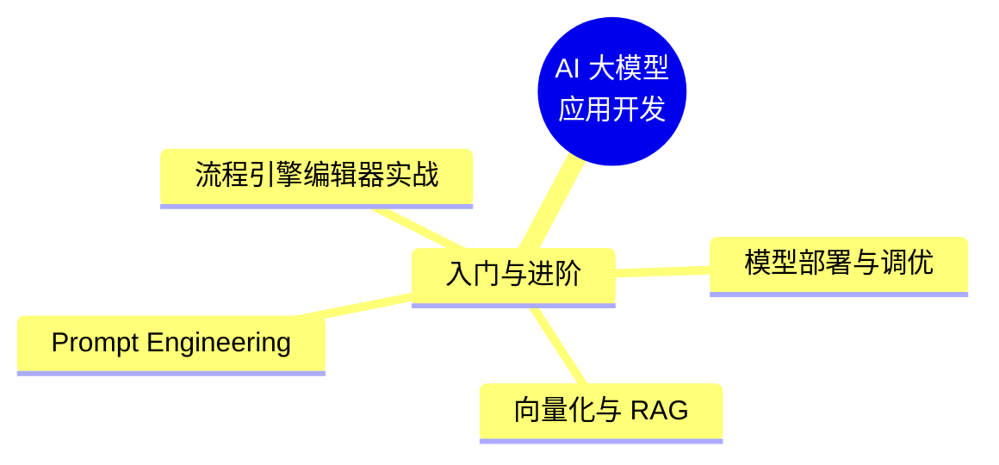

# AI 时代，程序员如何转变学习思维

> 这篇文章写给有开发经验、想转 AI 方向的程序员，也适合零基础刚入行的朋友。核心不是教某个 API 怎么用，而是讲清楚**一种学习的思路**。

## 一、大模型应用开发，其实没那么难

先给结论：**对于有基础的人来说，AI 应用开发非常简单。**

为什么这么说？

想想你平时在真实公司里，用 Vue / React / Java 写代码，来来回回用到的其实就那么几个 API。AI 应用开发本质上也是一样的——**它就是在调用第三方的库和接口**。

::: warning 我们不是要成为专家
我们是要成为**能干活的工程师**。市面上那些岗位——AI 前端、AI Agent、AI 应用开发、AI 全栈、AI 工程师——投简历时可以放心去投，这些都可以是你的方向。
:::

## 二、按需索取：建立「字典思维」

工作几年之后，学习方式和学生时代完全不一样了。核心思想就四个字：**按需索取**。

- **传统方式**：把一套体系从头到尾学一遍，从底层架构学到上层应用。
- **AI 时代方式**：**只学工作里真正用到的 API**，够用就行，能应聘、能干活的成本最低。

就像查字典——用到哪个字，查哪个字，而不是把整本字典背下来。

### 学习路线图

这张图给出了一个从入门到进阶的完整路线，跟着走即可，不用自己摸索。

## 三、计算机科学基础：程序员真正的「根」

整个 AI 学习大纲里，最核心的其实是**计算机科学基础知识**：

- 数据结构与算法
- 计算机网络
- 操作系统原理
- 数据库原理

一个程序员，不管做前端还是后端，这才是根。它训练的是你最值钱的能力：**逻辑思维能力、分析问题和解决问题的能力**。

### 语言只是一个工具

不管你现在写什么，语言永远只是一个工具。框架随时会出新版本，它只是一个库。

比如做 AI 开发要用到 [LangChain](https://www.langchain.com/)，以后可能又冒出新的库。那又怎样？你遇到新东西，不要排斥它，点开官网看一眼，把核心点摸清楚就好。

LangChain 提供了 Python 和 TypeScript 两个版本，对前端程序员来说，TS 版本可以无缝衔接。

### 面向官方文档编程的能力

英文不好怎么办？装翻译插件，或者直接丢给 AI 帮你翻译。

程序员最重要的能力是：**面向官方文档编程**。遇到新东西，第一时间去看官网的 document（文档）。

::: tip 一周掌握一个新工具
只要你具备底层逻辑思维，加上阅读文档的能力，市面上 99% 的新工具、新语言，你一周之内就能掌握。
:::

## 四、核心重点：五个方向

无论怎么学，最终要围绕这五个核心：

只要跟着坚持下来，你不只掌握了技能，面试时也能自信地去投 AI 相关岗位。

### 用官方脚手架，一天就能搞定

遇到不会的，学它——**只要做过开发，一天就能搞定**：

1. 用官方脚手架（CLI）把项目跑起来
2. 然后做业务功能
3. 业务功能怎么做？**面向官方文档编程**

以 [NestJS](https://nestjs.com/) 为例，文档里写得很清楚。你不需要把整个文档读完（有的地方工作 10~20 年都用不到），直接本地跑起来，然后学怎么创建 Controller / Model / 中间件——就是 MVC 那套，会了就能开发。

## 五、数据库怎么选

没学过 MySQL 也没关系，现在可以直接用 **PostgreSQL**。ORM 层用一个库（比如 Prisma），就是调用它封装好的方法而已，不用从底层自己造轮子。

## 六、AI 应用层开发：核心内容

说白了就是 [LangChain](https://www.langchain.com/) 的 API 使用，再加上：

- **检索增强（RAG）**：向量化 + 向量数据库的存储与调用
- **模型部署与调优**
- **LangGraph**：流程编排

整个开发、部署、代码管理、上线，说白了就是**配置文件的使用**，不会就问 AI。

再一次强调核心：**逻辑思维能力，分析问题、解决问题的能力**。

## 七、大部分人在焦虑，而不是在努力

最后送大家两句话：

> **你不是被 AI 淘汰了，你是被互联网上制造焦虑的人吓到了。**
>
> **大部分人在焦虑，而不是在努力。**

把焦虑收起来，努力行动起来。

很多课程一节课 40 分钟、1 个小时，一共一百多节——坚持不下来不是你的错。**10 分钟能讲明白的东西，硬是拖 1 个小时，全是废话，这才是浪费时间。**

## 八、坚持学下去的技巧

### 1. 学习坚持不下去，可能是材料的问题

我们总习惯从自己身上找原因："我学不下去，肯定是我自制力不行。"

但请换个角度想：**如果内容本身足够好、足够干货，是会驱使人想学下去的。**

很多人网盘里躺着几百 G 的学习资料，B 站收藏了一堆一小时长的视频——真正看完的有几个？这真的不是你的问题，是**材料的问题**。

### 2. 主动学习，而不是被动学习

学生时代是被动学习：所有人看同一套教材，不管你想不想看。进入职场后是**主动学习**：你得自己从嘈杂的互联网里，**筛选出有价值、有干货、能促使你主动学下去的好内容**。不管它是收费还是免费，值得就学。

### 3. 一定要分享出来

学生时代我们偷偷学，让别人以为你很聪明。但现在，**学习一定要分享出来**：

- 发朋友圈
- 写公开的笔记
- 开源出来

让别人知道你学习了。这既是监督，也是积累。

### 4. 能力要体现出来

在职场里，**你的能力要秀出来**，才能得到更多机会。做过的项目、写过的博客、录过的课，都是你找工作的资本。

### 5. 坚持下去，比什么都重要

成年人的学习，唯一的目的就是**能够坚持下去**。找到可持续、能促使你坚持下去的材料和内容，这才最核心。

下次再觉得"坚持不下去"的时候，先别急着怀疑自己——**也许是材料太垃圾了，换一个就好。**
