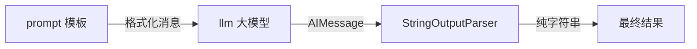
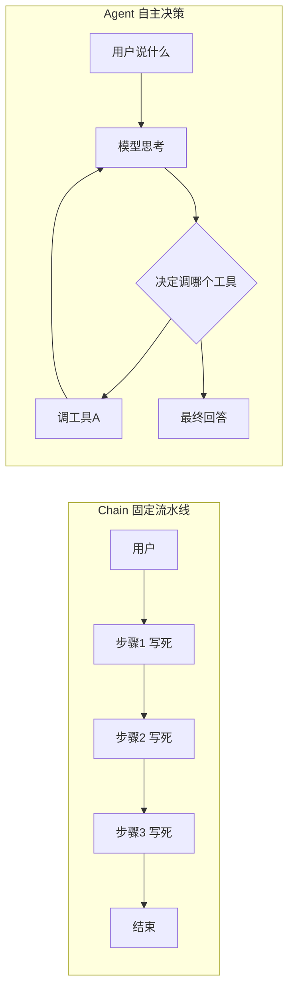
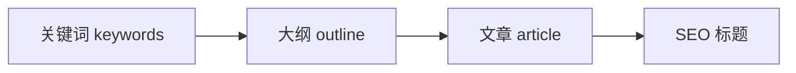
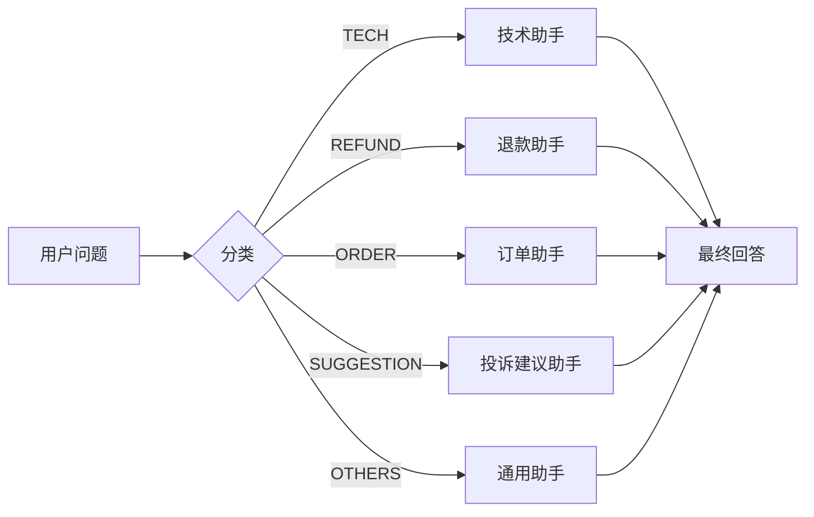
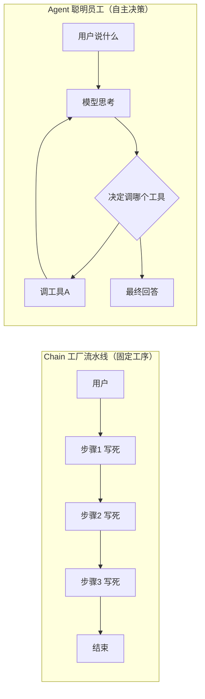
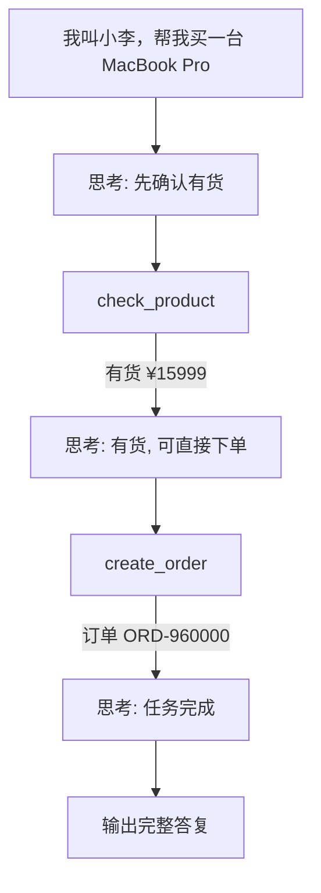
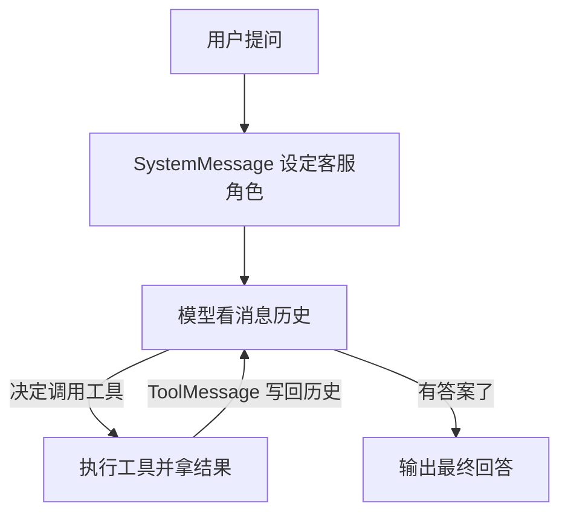
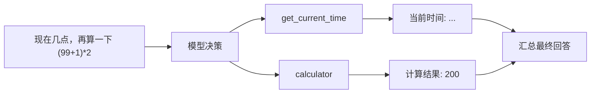

# NestJS + LangChain 大模型应用开发实战

> **适合人群**：熟悉 JS / TS / Vue / React，想转大模型应用开发的前端开发者
>
> **目标**：在 NestJS 项目里接入 LangChain，从"调用大模型"到"智能体 Agent"一步步写出真实的 AI 业务接口
>
> **技术栈**：NestJS + @langchain/ollama + Ollama（本地部署 qwen3.5:0.8b，免费）

## 一、为什么前端转大模型开发有优势

先看一张图，这是 LangChain 提供的完整模块全景——你接下来要学的就是它们：


LangChain 官网（[langchain.com](https://www.langchain.com/)）同时支持 **Python 和 TypeScript** 两种语言：


对前端开发者来说，这是巨大的优势：

- **JS / TS 你已经会了**，直接上手 LangChain，不需要学新语言
- 很多著名 AI 项目都是 TypeScript 写的，例如开源社区的 Claude 代码分析工具，源码几乎全是 `.ts` 后缀：


::: tip 一句话
前端转大模型开发，不是从零开始，而是把已有的 JS/TS 能力迁移到新场景。企业里要的是**能干活**，本课程的重点就是**写代码、跑通、演示**，每一个接口都能跑起来看到效果。
:::

## 二、安装 LangChain 依赖

### 1. 大模型从哪里来？

调用大模型有两种方式：

| 方式 | 说明 | 成本 |
| --- | --- | --- |
| 云 API | 注册 DeepSeek、OpenAI 等，创建 API Key | 按量收费 |
| 本地 Ollama | 把模型部署到本地电脑 | 免费，但对电脑配置要求高 |

本课程用 **Ollama 本地部署**：拉取一个体积很小的 `qwen3.5:0.8b`（约 1GB）对话模型，再拉一个 `mxbai-embed-large`（约 669MB）向量化模型（RAG 检索用）。

```bash
ollama pull qwen3.5:0.8b        # 对话模型
ollama pull mxbai-embed-large   # 向量化模型（RAG 用）

ollama list                     # 查看已安装的模型
```

### 2. 安装 LangChain 相关包

在项目根目录依次安装（`pnpm` 安装方式，不影响已有依赖）：

```bash
# 核心：LangChain Ollama 集成包（调用本地大模型）
pnpm install @langchain/ollama

# 核心：LangChain 基础类型和接口（消息、模板、解析器）
pnpm install @langchain/core

# 核心：LangChain 社区集成包（向量存储等）
pnpm install @langchain/community

# 文本分块器（RAG 用）
pnpm install @langchain/textsplitters

# LangChain 主包
pnpm install langchain

# 参数校验（Agent 工具 / Function Calling 用）
pnpm install zod
```

安装完成后，`package.json` 里会多出这些依赖：


### 3. 全局配置

新建 `src/config.ts`，把可变参数集中管理，以后换模型只改这一个文件：

```typescript
export const config = {
  ollama: {
    // Ollama 服务地址
    baseUrl: 'http://localhost:11434',
    // 对话模型
    chatModel: 'qwen3.5:0.8b',
    // 向量化模型（RAG 用）
    embedModel: 'mxbai-embed-large',
    // 温度：0 = 最保守，1 = 最随机
    temperature: 0.3,
  },
}
```

### 4. 生成模块

```bash
nest g module models
nest g controller models
nest g service models

nest g module prompts
nest g controller prompts
nest g service prompts

nest g module chains
nest g controller chains
nest g service chains

nest g module agents
nest g controller agents
nest g service agents
```

后续每个模块我们都按 **service（业务逻辑）→ controller（路由）** 的顺序写。

## 三、Models — 统一对接大模型

`models` 是整个体系最基础的部分：**把调用大模型抽象成统一接口**。不用 LangChain 时，每家模型 API 格式都不一样，换模型要大改代码；用了 LangChain，统一用 `.invoke()` / `.stream()`，换模型只改一行构造参数。

### 方式一：基础调用（等完整回答）

在 `models.service.ts` 里创建模型实例：

```typescript
import { ChatOllama } from '@langchain/ollama'
import { HumanMessage } from '@langchain/core/messages'
import { config } from '../config'

@Injectable()
export class ModelsService {
  // 创建 ChatOllama 实例（整个 Service 共用一个）
  private llm = new ChatOllama({
    model: config.ollama.chatModel,
    baseUrl: config.ollama.baseUrl,
    temperature: config.ollama.temperature,
  })

  async basicChat(message: string) {
    const response = await this.llm.invoke([
      new HumanMessage(message), // 用户消息
    ])
    return {
      question: message,
      answer: response.content,      // 模型回答的文字
      usage: response.usage_metadata, // token 消耗统计
    }
  }
}
```

Controller 对应路由：

```typescript
@Controller('models')
export class ModelsController {
  constructor(private readonly modelsService: ModelsService) {}

  @Post('chat')
  basicChat(@Body() { message }: { message: string }) {
    return this.modelsService.basicChat(message)
  }
}
```

用 Apifox 测试 `POST /models/chat`：


### 方式二：设定系统提示词

就像提问前先告诉模型"你是教育领域的专家"一样，用 `SystemMessage` 限定角色，把它变成**垂直领域的大模型**：

```typescript
async chatSystem(system: string, message: string) {
  const response = await this.llm.invoke([
    new SystemMessage(system),  // 系统提示（角色设定）
    new HumanMessage(message),  // 用户问题
  ])
  return {
    system,
    question: message,
    answer: response.content,
    usage: response.usage_metadata,
  }
}
```

测试 `POST /models/chat-system`，传入 `{ "system": "你是教育领域的专家", "message": "什么是 Vuex？" }`：


::: tip 卡顿怎么办？
本地小模型偶尔会很慢。可以在创建模型实例时关闭"思考模式"、限制输出长度：

```typescript
private llm = new ChatOllama({
  model: config.ollama.chatModel,
  temperature: config.ollama.temperature,
  baseUrl: config.ollama.baseUrl,
  think: false,   // 忽略推理过程
  numPredict: 521 // 不让生成太多 token
})
```
:::

### 方式三：流式输出（SSE）

真实业务里，接口返回**不可能是等一整段 JSON**，而是像 ChatGPT 那样一个字一个字蹦出来。这就要用 **SSE（Server-Sent Events）事件流**：

```typescript
import { Response } from 'express'

async chatStream({ message }: { message: string }, res: Response) {
  // 设置事件流响应头
  res.setHeader('Content-Type', 'text/event-stream')
  res.setHeader('Cache-Control', 'no-cache')
  res.setHeader('Connection', 'keep-alive')
  res.setHeader('Access-Control-Allow-Origin', '*')

  // stream 返回一个异步生成器，每次产出一个文字片段
  const stream = await this.llm.stream([new HumanMessage(message)])

  // 逐个片段写入响应体
  for await (const chunk of stream) {
    res.write(`data: ${JSON.stringify(chunk)}\n\n`)
  }
  // 结束标记，前端据此判断流结束
  res.write('data: [DONE]\n\n')
  res.end()
}
```

Controller 需要用 `@Res()` 直接拿到响应对象：

```typescript
@Post('chat-stream')
chatStream(@Body() { message }: { message: string }, @Res() res: Response) {
  return this.modelsService.chatStream({ message }, res)
}
```

测试 `POST /models/chat-stream`（Apifox 里把响应类型设为 Event Stream）：


这就是 ChatGPT"打字机"效果的底层原理：每个 `data:` 就是一个 chunk。

### 方式四：pipe 链 + 输出解析器

直接 `invoke` 返回的是一个 `AIMessage` 对象，里面除了文字还有一堆元数据：

```typescript
const response = await this.llm.invoke([new HumanMessage('你好')])
console.log(response)
// AIMessage {
//   content: '你好！有什么我可以帮你的？',
//   response_metadata: { model: 'qwen3.5:0.8b', ... },
//   usage_metadata: { input_tokens: 5, output_tokens: 12 },
//   ...
// }
// 要拿文字必须手动取 .content
```

很多场景我们只需要纯字符串。用 `pipe(new StringOutputParser())` 把它变成一条"管道链"：

```typescript
import { StringOutputParser } from '@langchain/core/output_parsers'

async chatParser(message: string) {
  // 把模型和解析器用 pipe 串联
  const chain = this.llm.pipe(new StringOutputParser())
  const answer = await chain.invoke([new HumanMessage(message)])
  // answer 直接是字符串
  return { question: message, answer }
}
```

pipe 的语义就是：**上一步的输出作为下一步的输入**。



测试 `POST /models/chat-parser`：


## 四、Prompts — 可复用提示词工程

提示词模板的价值：**同一类任务的结构固定，只有变量不同**。手动拼字符串容易拼错、无法复用，模板化之后自动替换占位符。

```typescript
// 手动拼字符串（不推荐）：
const prompt = `把"${text}"翻译成${lang}`

// ChatPromptTemplate（推荐）：
const template = ChatPromptTemplate.fromMessages([
  ['system', '你是翻译专家'],
  ['human', '把"{text}"翻译成{lang}'],
])
await template.invoke({ text: 'Hello', lang: '中文' })
// {text} 和 {lang} 是占位符，自动替换
```

### 1. 多消息对话模板：翻译（最常用）

```typescript
import { ChatPromptTemplate } from '@langchain/core/prompts'

async translate(text: string, targetLanguage: string) {
  const prompt = ChatPromptTemplate.fromMessages([
    ['system', '你是一个翻译助手，只输出翻译结果，帮助用户将文本翻译成指定语言。'],
    ['user', `请把以下的内容翻译成${targetLanguage}：${text}`],
  ])
  // 三步串成链：模板 → 模型 → 解析器
  const chain = prompt.pipe(this.llm).pipe(new StringOutputParser())
  const result = await chain.invoke({ text, targetLanguage })
  return { original: text, translation: result }
}
```

测试 `POST /prompts/translate`：


### 2. 单消息简单模板：文章总结

```typescript
import { PromptTemplate } from '@langchain/core/prompts'

async summarize(text: string, maxWords: number) {
  const prompt = PromptTemplate.fromTemplate(
    `请把以下的内容总结成不超过${maxWords}个字的版本：${text}`
  )
  const chain = prompt.pipe(this.llm).pipe(new StringOutputParser())
  const result = await chain.invoke({ text, maxWords })
  return { original: text, maxWords, summary: result }
}
```

测试 `POST /prompts/summarize`：


### 3. 少样本学习模板：情感分类

业务里最常见的需求：**根据用户评价分类成正面 / 负面**。不用解释规则，给模型几个例子它就学会了输出格式，这就是 Few-Shot：

```typescript
import { FewShotPromptTemplate, PromptTemplate } from '@langchain/core/prompts'

async classify(text: string) {
  // 预先给的样本
  const examples = [
    { text: '今天天气真好，我们去公园玩吧', label: '积极' },
    { text: '我讨厌这个产品，太差了', label: '消极' },
    { text: '这个电影还行，有些地方不错', label: '中立' },
    { text: '这很失望，我不会买了', label: '消极' },
  ]
  // 单个样本的格式
  const examplePrompt = PromptTemplate.fromTemplate('输入：{text}\n 输出：{label}')

  const fewShotPrompt = new FewShotPromptTemplate({
    examples,          // 样本数据
    examplePrompt,     // 样本格式
    prefix: '请根据输入的文本内容进行情感分类，输出积极、消极或中立', // 前缀
    suffix: '输入：{text}\n 输出：', // 后缀（真实问题）
    inputVariables: ['text'],
  })

  const formattedPrompt = await fewShotPrompt.format({ text })
  const res = await this.llm.invoke(formattedPrompt)
  return { text, label: res.content }
}
```

测试 `POST /prompts/classify`：


### 4. 代码审查

让大模型当你的代码评审专家，找出 bug 和改进建议：

```typescript
async codeReview(code: string, language: string) {
  const prompt = ChatPromptTemplate.fromMessages([
    ['system', '你是一个资深{language}代码审查助手，帮助用户找出代码中的错误和改进建议。'],
    ['human', '请帮我审查一下的 {language} 代码，并指出其中的错误和改进建议：\n{code}'],
  ])
  const chain = prompt.pipe(this.llm).pipe(new StringOutputParser())
  const result = await chain.invoke({ code, language })
  return { language, code, review: result }
}
```

测试 `POST /prompts/code-review`：


## 五、Chains — 链式调用

Chain 把多个步骤串联成流水线，每步输出作为下步输入。核心区别：

- **Chain = 工厂流水线**：步骤提前写死，自动执行，适合固定工作流
- **Agent = 聪明员工**：自己决定做什么、做几步



### 1. 多步骤链：文章润色（RunnableSequence）

"分析 → 润色"两步：先用模型分析出文章问题，再把问题和原文一起交给模型润色。

```typescript
import { RunnableSequence, RunnablePassthrough } from '@langchain/core/runnables'

async polish(article: string) {
  const analysisPrompt = ChatPromptTemplate.fromMessages([
    ['system', '你是一个文章分析助手，只输出问题列表，不要其他的内容。'],
    ['human', '分析这篇文章存在的问题：{article}'],
  ])
  const polishPrompt = ChatPromptTemplate.fromMessages([
    ['system', '你是一个文章润色助手，根据输出的问题列表对文章进行润色，改进文章的表达、结构、用词等方面。'],
    ['human', '请根据以下分析结果润色这篇文章：{analysis}，文章内容是：{article}'],
  ])

  // 第一步：article → 分析 → analysis 字符串
  const analysisChain = analysisPrompt.pipe(this.llm).pipe(new StringOutputParser())

  // 第二步：保留原文 + 调用分析链 → 润色
  const fullChain = RunnableSequence.from([
    {
      article: new RunnablePassthrough(), // 原文原样透传给下一步
      analysis: analysisChain,            // 并行执行分析链
    },
    polishPrompt.pipe(this.llm).pipe(new StringOutputParser()),
  ])

  const result = await fullChain.invoke({ article })
  return { original: article, polish: result }
}
```

测试 `POST /chains/polish`：


### 2. 顺序链：博客生成（关键词 → 大纲 → 文章 → SEO 标题）

上一步的输出作为下一步的输入，一步步来，逻辑最清晰：

```typescript
async generateBlog(keywords: string, style: string) {
  const outlinePrompt = ChatPromptTemplate.fromMessages([
    ['system', '你是一个博客大纲生成助手，根据用户提供的关键词和风格要求生成一篇博客文章大纲。'],
    ['human', '请根据以下关键词和风格要求生成一篇博客文章大纲。关键词：{keywords}，风格：{style}'],
  ]).pipe(this.llm).pipe(new StringOutputParser())

  const articlePrompt = ChatPromptTemplate.fromMessages([
    ['system', '你是一个博客文章生成助手，根据用户提供的大纲和风格要求生成一篇博客文章。'],
    ['human', '请根据以下大纲和风格要求生成一篇博客文章。博客大纲：{outline}'],
  ]).pipe(this.llm).pipe(new StringOutputParser())

  const seoTitlePrompt = ChatPromptTemplate.fromMessages([
    ['system', '你是一个博客文章seo标题生成助手，根据文章内容生成3个seo标题。'],
    ['human', '请根据以下文章内容生成3个seo标题。博客文章内容：{article}'],
  ]).pipe(this.llm).pipe(new StringOutputParser())

  // 顺序执行：关键词 → 大纲 → 文章 → SEO 标题
  const outline = await outlinePrompt.invoke({ keywords, style })
  const article = await articlePrompt.invoke({ outline })
  const seoTitles = await seoTitlePrompt.invoke({ article })

  return { keywords, style, outline, article, seoTitles }
}
```



测试 `POST /chains/blog`：


### 3. 条件链：智能客服路由

根据问题类型，路由到不同的"专家"去回答，类似智能客服转接：

```typescript
async smartRouter(question: string) {
  // 第一步：分类（只输出分类标签）
  const routerPrompt = ChatPromptTemplate.fromMessages([
    ['system', `分析用户的问题，只输出分类标签：
技术问题-TECH
退款问题-REFUND
订单问题-ORDER
投诉建议-SUGGESTION
其他-OTHERS`],
    ['human', '{question}'],
  ]).pipe(this.llm).pipe(new StringOutputParser())

  const category = await routerPrompt.invoke({ question })

  // 第二步：根据分类选择对应的角色
  const systemMap: Record<string, string> = {
    TECH: '你是一个技术支持助手，帮助用户解决技术问题。',
    ORDER: '你是一个订单助手，帮助用户管理订单。',
    REFUND: '你是一个退款助手，帮助用户处理退款。',
    SUGGESTION: '你是一个投诉建议助手，帮助用户提交投诉建议。',
    OTHERS: '你是一个其他助手，帮助用户处理其他问题。',
  }
  const systemMessage = systemMap[category] || systemMap.OTHERS

  // 第三步：带着分类角色回答
  const answerPrompt = ChatPromptTemplate.fromMessages([
    ['system', systemMessage],
    ['human', '{question}'],
  ]).pipe(this.llm).pipe(new StringOutputParser())

  const answer = await answerPrompt.invoke({ question })
  return { question, category, answer }
}
```



测试 `POST /chains/router`：


## 六、Agents — 智能代理（课程重点）

### 1. Agent 是什么：Chain 是流水线，Agent 是聪明员工

| | Chain（固定流程） | Agent（自主决策） |
| --- | --- | --- |
| 流程 | 提前写死，步骤固定 | 模型自己决定 |
| 比喻 | 工厂流水线（固定工序） | 聪明的员工（自己决定做什么） |
| 数据流 | 用户 → 步骤1 → 步骤2 → 步骤3 → 结束 | 用户说什么 → 模型思考 → 决定调工具 → 看结果 → 再决定 → 最终回答 |



**录视频时的核心对比话术**（记住这三连问，给别人讲也能直接用）：

> **问**：用 Chain 实现"先查库存再下单"怎么写？
> **答**：要提前写死流程——step1 查库存、step2 下单，步骤固定。
>
> **再问**：如果用户说"查一下我的订单"，这条 Chain 能处理吗？
> **答**：不能，Chain 是固定流程，换一个意图整条链就跑不通。
>
> **Agent 的价值**：不需要提前写死流程，模型自己看用户说什么，决定调用哪个工具、调用几次。**同一套代码，灵活处理查库存、下单、查订单、退款等多种意图**。

### 2. 本节示例：极速购电商 AI 智能客服

以"极速购"电商平台的 AI 智能客服为例：

```plain
用户：「我叫小李，帮我买一台 MacBook Pro」

Agent 自主决策流程：
  思考：用户想购买，但我需要先确认商品是否有货
  行动：调用 check_product → 「MacBook Pro 有货，¥15999」
  思考：有货，用户已报名字，可以直接下单
  行动：调用 create_order → 「订单 ORD-960000 创建成功」
  思考：任务完成，给用户完整答复
  输出：「小李您好！MacBook Pro 有货已下单，订单号 ORD-960000，总价 ¥15999」
```



**注意**：Agent 自主串联了 `check_product → create_order` 两个工具，但代码里**没有写死这个顺序**——全是模型看用户说了什么之后自己决定的。

### 3. 定义工具：tool() + zod（4 个工具）

工具就是**把普通的 JS 函数包装成模型能识别的格式**。`tool()` 的每个参数都有讲究：

- `name`：工具名称（模型据此决定何时调用）
- `description`：工具描述（**模型据此理解这个工具能干什么，写清楚很关键**）
- `schema`：参数定义（zod 格式，告诉模型调用时要传什么参数）

```typescript
import { tool } from '@langchain/core/tools'
import { z } from 'zod'

// 工具1：查询商品库存和价格
private checkProductTool = tool(
  async ({ productName }: { productName: string }) => {
    // 模拟商品数据库（实际项目注入 PrismaService 查真实数据库）
    const products: Record<string, { price: number; stock: number; category: string }> = {
      'iPhone 16':     { price: 7999,  stock: 50,  category: '手机' },
      'iPhone 16 Pro': { price: 9999,  stock: 20,  category: '手机' },
      'MacBook Pro':   { price: 15999, stock: 8,   category: '电脑' },
      'AirPods Pro':   { price: 1799,  stock: 200, category: '耳机' },
      'iPad Air':      { price: 4799,  stock: 30,  category: '平板' },
    }
    const product = products[productName]
    if (!product) return `商品「${productName}」不存在，请检查商品名称是否正确。`
    if (product.stock === 0) return `商品「${productName}」当前缺货，预计下周补货。`
    return `商品「${productName}」有货，单价 ¥${product.price}，库存 ${product.stock} 件，分类：${product.category}。`
  },
  {
    name: 'check_product',
    // description 非常关键：模型根据这段描述决定何时调用这个工具
    description: '查询商品是否有货、商品价格和库存数量。用户问"有没有XX"、"XX多少钱"、"XX有货吗"时调用。',
    schema: z.object({
      productName: z.string().describe('商品名称，例如 iPhone 16、MacBook Pro'),
    }),
  },
)

// 工具2：创建订单
private createOrderTool = tool(
  async ({ productName, quantity, customerName }: {
    productName: string
    quantity: number
    customerName: string
  }) => {
    const prices: Record<string, number> = {
      'iPhone 16': 7999, 'iPhone 16 Pro': 9999,
      'MacBook Pro': 15999, 'AirPods Pro': 1799, 'iPad Air': 4799,
    }
    const unitPrice = prices[productName] ?? 0
    const totalPrice = unitPrice * quantity
    const orderId = `ORD-${Date.now().toString().slice(-6)}`
    return `订单创建成功！订单号：${orderId}，客户：${customerName}，商品：${productName} x${quantity}，单价 ¥${unitPrice}，总价 ¥${totalPrice}。请在 30 分钟内完成支付。`
  },
  {
    name: 'create_order',
    description: '为客户创建购买订单。需要知道商品名称、购买数量、客户姓名才能下单。用户说"我要买XX"、"帮我下单"时调用。',
    schema: z.object({
      productName:  z.string().describe('商品名称'),
      quantity:     z.number().describe('购买数量，默认为 1'),
      customerName: z.string().describe('客户姓名'),
    }),
  },
)

// 工具3：查询订单状态
private checkOrderTool = tool(
  async ({ orderId }: { orderId: string }) => {
    const statuses = ['待支付', '已支付待发货', '已发货运输中', '已签收']
    const status = statuses[Math.floor(Math.random() * statuses.length)]
    const extra = status === '已发货运输中' ? '，预计明天送达' : ''
    return `订单 ${orderId} 当前状态：${status}${extra}。`
  },
  {
    name: 'check_order',
    description: '查询订单的当前状态。用户说"我的订单"、"订单到哪了"、"查一下订单 ORD-XXX"时调用。',
    schema: z.object({
      orderId: z.string().describe('订单号，格式为 ORD-XXXXXX'),
    }),
  },
)

// 工具4：申请退款
private applyRefundTool = tool(
  async ({ orderId, reason }: { orderId: string; reason: string }) => {
    const refundId = `REF-${Date.now().toString().slice(-6)}`
    return `退款申请已提交！退款单号：${refundId}，订单：${orderId}，退款原因：${reason}。预计 1-3 个工作日内退回原支付渠道，请注意查收。`
  },
  {
    name: 'apply_refund',
    description: '为客户申请订单退款。用户说"我要退款"、"申请退货"、"不想要了"时调用。需要订单号和退款原因。',
    schema: z.object({
      orderId: z.string().describe('需要退款的订单号'),
      reason:  z.string().describe('退款原因，例如：质量问题、不喜欢、买错了'),
    }),
  },
)
```

### 4. Agent 核心执行逻辑

```typescript
import { ChatOllama } from '@langchain/ollama'
import { tool } from '@langchain/core/tools'
import { z } from 'zod'
import { HumanMessage, AIMessage, ToolMessage, SystemMessage } from '@langchain/core/messages'
import { config } from '../config'

@Injectable()
export class AgentsService {
  // Agent 使用的模型：temperature 低一点，让工具调用决策更稳定
  private llm = new ChatOllama({
    model: config.ollama.chatModel,
    baseUrl: config.ollama.baseUrl,
    temperature: 0.1,  // 低温度，让工具调用决策更稳定
    think: false,
    numPredict: 1024,
  })

  // …… 4 个工具定义（见上文 3.）……

  async runAgent(userMessage: string) {
    const tools = [
      this.checkProductTool,
      this.createOrderTool,
      this.checkOrderTool,
      this.applyRefundTool,
    ]

    // 工具名 → 工具实例 的映射表
    const toolMap: Record<string, any> = {
      check_product: this.checkProductTool,
      create_order:  this.createOrderTool,
      check_order:   this.checkOrderTool,
      apply_refund:  this.applyRefundTool,
    }

    // bindTools：把工具列表注册到模型
    // 注册后，模型回复里会带 tool_calls 字段（当它决定调用工具时）
    const llmWithTools = this.llm.bindTools(tools)

    // 消息历史：Agent 每一轮都能看到完整的对话 + 工具结果
    const messages: any[] = [
      // System 消息：设定客服角色和行为规范
      new SystemMessage(
        `你是「极速购」电商平台的 AI 智能客服助手。
你可以使用以下工具帮助客户：
- check_product：查询商品库存和价格
- create_order：为客户创建订单
- check_order：查询订单状态
- apply_refund：申请退款

工作原则：
1. 先用工具获取真实信息，再给客户答复
2. 下单前必须先查询库存确认有货
3. 下单需要知道客户姓名，如果用户没说，主动询问
4. 回答简洁友好，使用中文`,
      ),
      new HumanMessage(userMessage),
    ]

    // 记录每步执行过程（用于前端展示 / 课程演示）
    const steps: string[] = []
    let roundCount = 0

    // Agent 循环：每一轮模型看消息历史 → 决定调用工具还是直接回答
    // 直到模型不再调用工具为止（最多 6 轮，防止死循环）
    while (roundCount < 6) {
      roundCount++
      const response = await llmWithTools.invoke(messages)
      messages.push(response) // 把模型回复加入历史

      // tool_calls 为空 → 模型有了最终答案，退出循环
      if (!response.tool_calls || response.tool_calls.length === 0) {
        steps.push(`💬 [最终回答] ${response.content}`)
        break
      }

      // 模型决定调用工具，依次执行所有工具调用
      for (const toolCall of response.tool_calls) {
        steps.push(`🔧 [调用工具] ${toolCall.name}(${JSON.stringify(toolCall.args)})`)

        const toolFn = toolMap[toolCall.name]
        if (!toolFn) {
          // 容错：工具不存在时也要把错误回给模型，让它换个说法
          const errMsg = `工具「${toolCall.name}」不存在`
          steps.push(`❌ [错误] ${errMsg}`)
          messages.push(new ToolMessage({ content: errMsg, tool_call_id: toolCall.id }))
          continue
        }

        // 执行工具，获取结果
        const toolResult = await toolFn.invoke(toolCall.args)
        steps.push(`✅ [工具结果] ${toolResult}`)

        // 把工具结果加入消息历史
        // 模型下一轮看到结果后，再决定继续调工具还是直接回答
        messages.push(
          new ToolMessage({ content: String(toolResult), tool_call_id: toolCall.id }),
        )
      }
    }

    // 取最后一条 AI 消息作为最终回答
    const lastAI = [...messages].reverse().find(m => m instanceof AIMessage)
    return {
      userMessage,
      steps,        // 完整的"思考-行动"过程
      totalRounds: roundCount,
      answer: lastAI?.content ?? '抱歉，暂时无法处理您的请求',
    }
  }
}
```



### 5. 路由：`agents.controller.ts`

```typescript
import { Controller, Post, Body } from '@nestjs/common'
import { AgentsService } from './agents.service'

@Controller('agents')
export class AgentsController {
  constructor(private readonly agentsService: AgentsService) {}

  // POST /agents/run
  @Post('run')
  runAgent(@Body() body: { message: string }) {
    return this.agentsService.runAgent(body.message)
  }
}
```

### 6. 测试用例（Apifox）

在 Apifox 里打 `POST http://localhost:3000/agents/run`，一条条测：

| 用例 | 请求体 | 预期：Agent 会怎么决策 |
| --- | --- | --- |
| 查库存 | `{"message":"MacBook Pro 有货吗？多少钱？"}` | 调 `check_product` → 有货 ¥15999 |
| 下单 | `{"message":"我叫小李，帮我买一台 MacBook Pro"}` | 先 `check_product` 确认有货 → 再 `create_order`（**自主串联两个工具**） |
| 查订单 | `{"message":"我的订单 ORD-960000 到哪了？"}` | 调 `check_order` → 返回当前状态 |
| 退款 | `{"message":"我要给订单 ORD-960000 申请退款，原因是质量问题"}` | 调 `apply_refund` → 返回退款单号 |

返回的 `steps` 数组里能看到 Agent 完整的决策过程：**先自己判断要查库存 → 调 check_product → 看到有货 → 再调 create_order → 输出最终答复**，整个顺序代码里没有写死，全是模型自主决定的。

::: tip System 消息为什么要写"工作原则"
大模型本身"没有纪律"。System 里写清楚"下单前必须先查库存""没说姓名就主动询问"，模型就按规矩来——**Agent 的靠谱程度，一半靠工具写得好，一半靠 System 立规矩**。
::: 

### 7. 加餐：换个场景，Agent 同一套代码直接复用

上面的电商客服是业务版。Agent 的价值是**场景和工具解耦**——换一组工具，同一套 `runAgent` 循环逻辑几乎不用改。下面换一批"通用小工具"：计算器、当前时间、单位换算，体验一下 Agent 可以**一次决定调用多个工具**。

```typescript
// 工具A：计算器
private calculatorTool = tool(
  async ({ expression }: { expression: string }) => {
    try {
      // 用 Function 执行数学表达式（生产环境请用安全的计算库）
      const result = new Function(`return ${expression}`)()
      return `计算结果：${expression} = ${result}`
    } catch {
      return `计算出错：无法计算 ${expression}`
    }
  },
  {
    name: 'calculator',
    description: '数学计算器，用于计算数学表达式，例如 2+3*4、sqrt(16)、100/5',
    schema: z.object({
      expression: z.string().describe('数学表达式，例如 2+3*4'),
    }),
  },
)

// 工具B：获取当前时间
private timeTool = tool(
  async () => {
    const now = new Date()
    return `当前时间：${now.toLocaleString('zh-CN', { timeZone: 'Asia/Shanghai' })}`
  },
  {
    name: 'get_current_time',
    description: '获取当前的日期和时间',
    schema: z.object({}),
  },
)

// 工具C：单位换算（长度 / 温度）
private unitConverterTool = tool(
  async ({ value, fromUnit, toUnit }: { value: number; fromUnit: string; toUnit: string }) => {
    // 温度特殊处理
    if (fromUnit === 'celsius' && toUnit === 'fahrenheit') {
      return `${value}°C = ${((value * 9) / 5 + 32).toFixed(2)}°F`
    }
    if (fromUnit === 'fahrenheit' && toUnit === 'celsius') {
      return `${value}°F = ${(((value - 32) * 5) / 9).toFixed(2)}°C`
    }
    // 长度换算（基准：米）
    const conversions: Record<string, Record<string, number>> = {
      km: { m: 1000, cm: 100000, mm: 1000000 },
      m:  { km: 0.001, cm: 100, mm: 1000 },
    }
    const rate = conversions[fromUnit]?.[toUnit]
    if (!rate) return `不支持 ${fromUnit} 到 ${toUnit} 的换算`
    return `${value} ${fromUnit} = ${value * rate} ${toUnit}`
  },
  {
    name: 'unit_converter',
    description: '单位换算工具，支持长度（km/m/cm/mm）和温度（celsius/fahrenheit）换算',
    schema: z.object({
      value: z.number().describe('要换算的数值'),
      fromUnit: z.string().describe('原单位，例如 km、celsius'),
      toUnit: z.string().describe('目标单位，例如 m、fahrenheit'),
    }),
  },
)
```

换一组工具的 `runAgent` 核心循环，和第 4 节一模一样，只改 `tools` / `toolMap`：

```typescript
async runAgent(userMessage: string) {
  const tools = [this.calculatorTool, this.timeTool, this.unitConverterTool]
  const llmWithTools = this.llm.bindTools(tools)

  const toolMap = {
    calculator: this.calculatorTool,
    get_current_time: this.timeTool,
    unit_converter: this.unitConverterTool,
  }

  const messages: any[] = [new HumanMessage(userMessage)]
  const steps: string[] = []

  for (let i = 0; i < 5; i++) {
    const response = await llmWithTools.invoke(messages)
    messages.push(response)

    if (!response.tool_calls || response.tool_calls.length === 0) {
      steps.push(`[最终回答] ${response.content}`)
      break
    }

    for (const toolCall of response.tool_calls) {
      const toolFn = toolMap[toolCall.name]
      if (!toolFn) {
        steps.push(`[工具不存在] ${toolCall.name}`)
        continue
      }
      steps.push(`[调用工具] ${toolCall.name}(${JSON.stringify(toolCall.args)})`)
      const toolResult = await toolFn.invoke(toolCall.args)
      steps.push(`[工具结果] ${toolResult}`)
      messages.push(
        new ToolMessage({ content: String(toolResult), tool_call_id: toolCall.id }),
      )
    }
  }

  const lastAIMessage = [...messages].reverse().find(m => m instanceof AIMessage)
  return {
    question: userMessage,
    steps,
    answer: lastAIMessage?.content || '无法得出答案',
  }
}
```

测试用例（重点看最后一个"组合调用"）：

| 用例 | 请求体 | 预期：Agent 会怎么决策 |
| --- | --- | --- |
| 时间 | `{"message":"现在几点了？"}` | 调 `get_current_time` |
| 换算 | `{"message":"100 摄氏度等于多少华氏度？"}` | 调 `unit_converter` |
| 计算 | `{"message":"1024 * 768 等于多少？再加上 1920 * 1080 是多少？"}` | **调两次** `calculator` |
| 组合 | `{"message":"现在几点，再算一下 (99 + 1) * 2"}` | **同时调** `get_current_time` 和 `calculator` |



注意"调两次"和"同时调两个"这两条：`tool_calls` 本身就是**数组**，模型一次回复可以带多个工具调用，循环里逐个执行即可——**多工具并发决策**是 Agent 相对 Chain 的又一大优势。

## 七、系列导航：下半场还有四篇

回顾整条主线，你已经掌握了：

| 模块 | 解决什么问题 | 关键 API |
| --- | --- | --- |
| Models | 统一对接大模型 | `ChatOllama` / `.invoke()` / `.stream()` |
| Prompts | 提示词模板化复用 | `ChatPromptTemplate` / `PromptTemplate` / `FewShotPromptTemplate` |
| Chains | 固定流程串联 | `pipe()` / `RunnableSequence` / `RunnablePassthrough` |
| Agents | 模型自主决策调用工具 | `tool()` + `zod` / `bindTools()` / `ToolMessage` |

::: tip 本系列完整目录
| 篇目 | 链接 | 一句话内容 |
| --- | --- | --- |
| 基础篇（本篇） | [NestJS + LangChain 集成与基础](/articles/nestjs-langchain-ai-app) | 安装、Models、Prompts、Chains、Agents |
| 记忆篇 | [Memory 多轮对话记忆](/articles/nestjs-langchain-memory) | 让模型"记住上文"，真实业务如何持久化 |
| 检索篇 | [RAG 检索增强](/articles/nestjs-langchain-rag) | 先翻书再回答，解决幻觉，核心组件详解 |
| 存储篇 | [三种向量存储方案与 pgvector](/articles/nestjs-langchain-vectorstore) | Memory/PGVector/Chroma + 建表检索 + 维度 |
| 工具篇 | [Function Calling 与测试汇总](/articles/nestjs-langchain-function-calling) | 自然语言转结构化函数参数 + 全接口测试表 |
:::

::: tip 学习思路
看懂视频和亲手实操完全是两回事——实操会碰到各种问题，问题都有解，可以丢给 AI 帮忙。核心是**坚持学下去、把项目跑起来**。在 AI 时代，要有全流程的软件开发思维，不要只聚焦业务功能，**项目的部署和上线才是最核心的能力**。
:::
