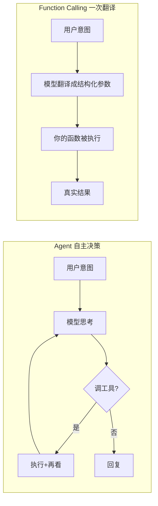

# Function Calling — 让大模型"会调用你的函数"

> **前置**：已完成 [Agents 智能代理](/articles/nestjs-langchain-ai-app#六-agents--智能代理课程重点)
>
> **目标**：理解 Function Calling 与 Agent 的区别，实现"自然语言 → 结构化函数调用参数 → 执行真实代码"的完整链路
>
> **技术栈**：NestJS + @langchain/ollama + zod

## 一、先行概念：Function Calling 是什么？

上一课的 Agent，本质是模型 + 工具 + 循环，适合"多步自主决策"。而 **Function Calling（函数调用）** 更直接：**大模型输出一个结构化的调用指令（函数名 + 参数），我们把参数喂给真实的业务函数，拿到结果**。

一句话区别：

- **Agent**：你自己管理循环，模型想调几次调几次（带"思考过程"）；
- **Function Calling**：只关心**一次**把自然语言翻译成"该调用哪个函数、传什么参数"——翻译好了就交给你的代码执行。



典型场景：用户在对话框里说"帮我查北京明天天气"，Function Calling 把它翻译成 `{ 函数: "get_weather", 参数: { city: "北京", date: "明天" } }`，你的代码拿着参数去调天气 API，返回答复用户。**模型不自己猜天气，它只负责翻译，数字由你的真实系统给出**——这就是"调用"的含义。

## 二、完整实战：嵌套的电商下单 + 天气

### 1. 生成模块

```bash
nest g module function-calling
nest g controller function-calling
nest g service function-calling
```

### 2. `function-calling.service.ts`

核心是三步：**bindTools 注册工具 → 模型返回 tool_calls → 用 zod 解析参数并执行**。

```typescript
import { Injectable } from '@nestjs/common'
import { ChatOllama } from '@langchain/ollama'
import { HumanMessage, ToolMessage } from '@langchain/core/messages'
import { z } from 'zod'
import { config } from '../config'

@Injectable()
export class FunctionCallingService {
  private llm = new ChatOllama({
    model: config.ollama.chatModel,
    baseUrl: config.ollama.baseUrl,
    temperature: 0,
  })

  // ---------- 工具1：查询天气（外部 API 用假数据演示） ----------
  private weatherSchema = {
    name: 'get_weather',
    description: '根据城市和日期查询当地天气',
    schema: z.object({
      city: z.string().describe('城市名称，例如：北京、上海'),
      date: z.string().describe('日期，例如：今天、明天、2026-08-15'),
    }),
  }

  async getWeather({ city, date }: { city: string; date: string }) {
    // 真实项目这里换成调用天气服务商 API
    return `${city}${date}天气：晴，28℃，适合出门（这是演示数据）`
  }

  // ---------- 工具2：电商下单（复用上一篇的商品表） ----------
  private orderSchema = {
    name: 'create_order',
    description: '创建商品订单，需要商品名、数量、客户姓名',
    schema: z.object({
      productName: z.string().describe('商品名字，例如：iPhone 18、MacBook Pro'),
      quantity: z.number().describe('购买数量'),
      customerName: z.string().describe('客户姓名'),
    }),
  }

  async createOrder({ productName, quantity, customerName }: { productName: string; quantity: number; customerName: string }) {
    const prices: Record<string, number> = {
      'iPhone 18': 7999,
      'MacBook Pro': 10000,
      'AirPods Pro': 2000,
    }
    const unitPrice = prices[productName]
    if (!unitPrice) return `商品${productName}不存在`
    const orderId = `ORDER-${Date.now().toString().slice(-6)}`
    return `订单 ${orderId} 创建成功，${productName} x${quantity}，客户 ${customerName}，总价 ${unitPrice * quantity} 元`
  }

  // ---------- 核心入口：自然语言 → 函数调用 ----------
  async run(userMessage: string) {
    const tools = {
      get_weather: this.getWeather.bind(this),
      create_order: this.createOrder.bind(this),
    }

    // 把要暴露给模型的两个工具注册进去
    const llmWithTools = this.llm.bindTools([
      { type: 'tool' as const, ...this.weatherSchema },
      { type: 'tool' as const, ...this.orderSchema },
    ])

    // 模型第一次回答 —— 只会有两种结果：
    // 1) 回复文字（说明它不需要调用函数）
    // 2) 带 tool_calls 数组（它决定调用哪个函数 + 参数）
    const response = await llmWithTools.invoke([new HumanMessage(userMessage)])

    // 情况 A：没调用任何函数，直接返回文字回答
    if (!response.tool_calls?.length) {
      return {
        triggeredTools: [],
        answer: response.content,
      }
    }
    // 情况 B：模型给出了结构化调用指令
    const results: { name: string; args: any; result: string }[] = []
    for (const call of response.tool_calls) {
      const fn = tools[call.name as keyof typeof tools]
      if (!fn) continue
      // call.args 就是模型翻译出的结构化参数
      const result = await fn(call.args)
      results.push({ name: call.name, args: call.args, result })
    }

    // 演示从 API 返回结构化 call 结果，便于前端展示"调了哪个函数"
    return { triggeredTools: results, userMessage }
  }
}
```

::: tip tool_calls 是什么
当你 `bindTools` 注册了工具后，模型如果觉得"这里得调用函数"，它的 `tool_calls` 字段就长这样：

```jsonc
[
  {
    "name": "get_weather",
    "args": { "city": "北京", "date": "明天" },  // ← 模型翻译出的参数
    "id": "call_xxxx"
  }
]
```

**zod 的 `describe`** 就是写给模型看的"参数说明"：模型靠它才知道 `date` 该填"明天"而不是"2026"。
:::

### 3. `function-calling.controller.ts`

```typescript
import { Body, Controller, Post } from '@nestjs/common'
import { FunctionCallingService } from './function-calling.service'

@Controller('function-calling')
export class FunctionCallingController {
  constructor(private readonly service: FunctionCallingService) {}

  // POST /function-calling/run  { "message": "帮我查一下北京明天的天气" }
  @Post('run')
  run(@Body() body: { message: string }) {
    return this.service.run(body.message)
  }
}
```

在 `app.module.ts` 的 `imports` 里追加 `FunctionCallingModule`。

## 三、Apifox 验证

**用例 1：明确触发函数**

```
POST /function-calling/run
{ "message": "帮我查一下北京明天的天气" }
```

返回（示意）：
```jsonc
{
  "triggeredTools": [
    {
      "name": "get_weather",
      "args": { "city": "北京", "date": "明天" },
      "result": "北京明天天气：晴，28℃，适合出门（这是演示数据）"
    }
  ]
}
```

看关键点：**"北京""明天"是模型从自然语言里抽出来的参数**，没让用户去填表单。

**用例 2：组合参数的下单**

```
POST /function-calling/run
{ "message": "张三买2台MacBook Pro" }
```

模型应翻译成 `create_order({ productName:"MacBook Pro", quantity:2, customerName:"张三" })`，返回订单号和总价。

**用例 3：不需要函数的普通问题**——问"你是谁"，应该走"情况 A"，返回纯文字，`triggeredTools: []`。

::: tip Agent vs Function Calling 什么时候用哪个
| 场景 | 用谁 |
| --- | --- |
| 一次翻译：查天气 / 下单 / 查快递 单步 | **Function Calling** |
| 多步串起来：查货→下单→查订单 自主作业 | **Agent** |
| 工具多、意图飘忽 | Agent（它有循环兜底） |
:::

## 四、全课程接口测试汇总表

写完全套课程，把你的 NestJS 项目跑起来（`pnpm start:dev`），按这个表把每个接口打一遍，就集齐了整条主线：

| 模块 | 方法 | 路径 | 请求体示例 | 预期看什么 |
| --- | --- | --- | --- | --- |
| Models | POST | `/models/chat` | `{"message":"你好"}` | 返回 `answer` |
| Models | POST | `/models/chat-system` | `{"system":"你是教育专家","message":"什么是Vuex?"}` | 角色化回答 |
| Models | POST | `/models/chat-stream` | `{"message":"写首诗"}` | SSE 流式 `data:` 片段 |
| Models | POST | `/models/chat-parser` | `{"message":"你好"}` | `answer` 是纯字符串 |
| Prompts | POST | `/prompts/translate` | `{"text":"Hello","targetLanguage":"中文"}` | 只输出翻译 |
| Prompts | POST | `/prompts/summarize` | `{"text":"...","maxWords":50}` | 压缩总结 |
| Prompts | POST | `/prompts/classify` | `{"text":"这个太好用了"}` | 积极/消极/中立 |
| Prompts | POST | `/prompts/code-review` | `{"code":"...","language":"javascript"}` | bug 与建议 |
| Chains | POST | `/chains/polish` | `{"article":"..."}` | 分析+润色两步 |
| Chains | POST | `/chains/blog` | `{"keywords":"AI","style":"轻松"}` | 大纲/文章/SEO标题 |
| Chains | POST | `/chains/router` | `{"question":"怎么退款?"}` | `category` 是 REFUND |
| Agents | POST | `/agents/run` | `{"message":"张三买一台MacBook Pro"}` | `steps` 决策过程 |
| **Memory** | POST | `/memory/chat` | `{"sessionId":"demo","message":"我叫小红"}` | 第二轮记得名字 |
| **Memory** | GET | `/memory/history` | `?sessionId=demo` | 完整对话 |
| **Memory** | DELETE | `/memory/clear` | `?sessionId=demo` | 清空成功 |
| **RAG** | POST | `/rag/load` | `{"text":"公司合同三年…","metadata":{}}` | chunkCount |
| **RAG** | POST | `/rag/query` | `{"message":"合同几年?"}` | 依据资料的答案 |
| **RAG** | GET | `/rag/search` | `?query=合同&k=3` | 相关卡片排序 |
| **Function Calling** | POST | `/function-calling/run` | `{"message":"查北京明天天气"}` | `triggeredTools` |

::: tip 推荐测试顺序
Models（打底）→ Prompts（模板复用）→ Chains（串联）→ Agents（自主决策）→ Memory（记住上文）→ RAG（先翻书再回答，需先 `load`）→ Function Calling（自然语言转参数）。**每一块都能独立跑通看到效果**，这正是这门课的基本要求——能干活。
:::

## 五、写在最后的十句心得

1. 大模型本身**不记事**，记忆靠我们维护历史；**不查资料**，RAG 帮它先搜再答。
2. 统一接口（`invoke` / `stream` / `similaritySearch`）是 LangChain 的价值：**换模型、换向量库，业务代码几乎不动**。
3. 向量维度由模型定、用就锁死，混用模型会让向量库全军覆没。
4. Agent 靠 `bindTools` + `tool_calls` 循环，Function Calling 是同一机制的"单次版"。
5. System 提示词、`describe` 参数说明写得越清楚，模型表现越稳定——**对模型说话和对同事说话一样，说得清它才干得准**。
6. 本地 qwen3.5:0.8b 只是入门，生产换大模型（如 Qwen2.5、DeepSeek、GPT）只需改 `config.ts`。
7. 每个接口（流式、工具、RAG）先用后学原理，**跑通 > 完美**。
8. 项目能跑还不够，**部署上线**才是完整能力——本课程刻意让每步都是"可演示的成果"。
9. 遇错别慌，看报错 + 问 AI，问题基本都有解。
10. **坚持动手，把这套接口全部跑通，你就已经是大模型后端开发入门了。**