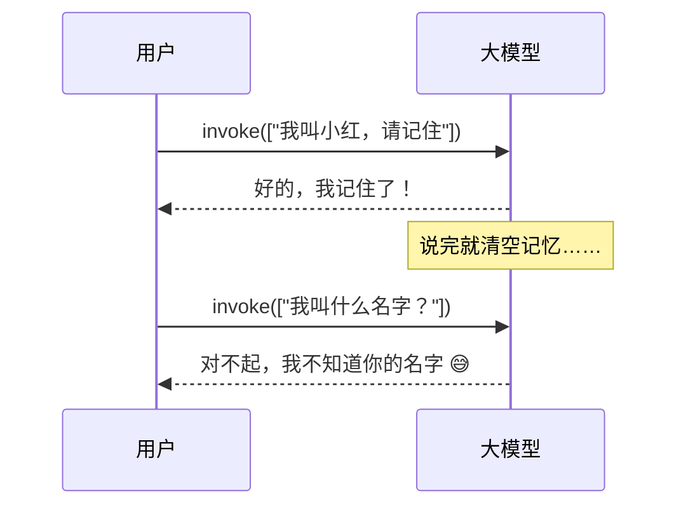
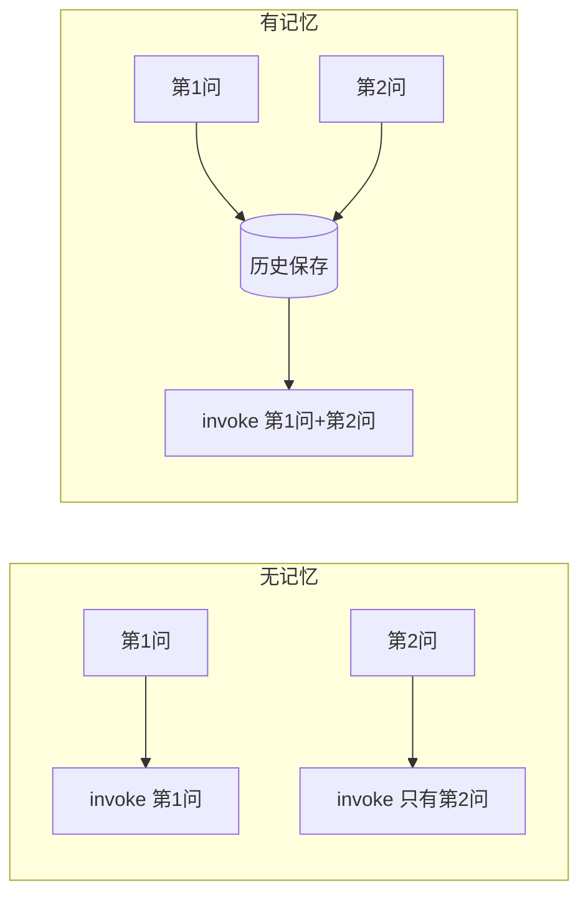
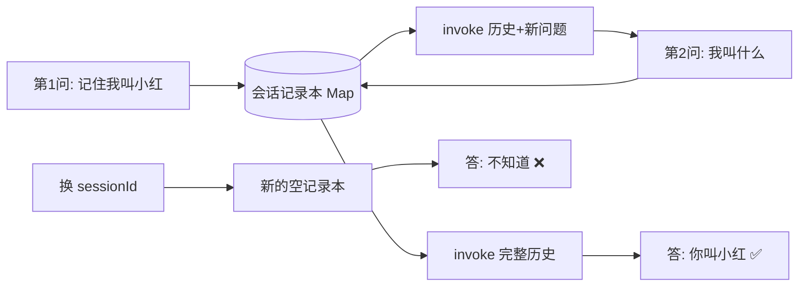
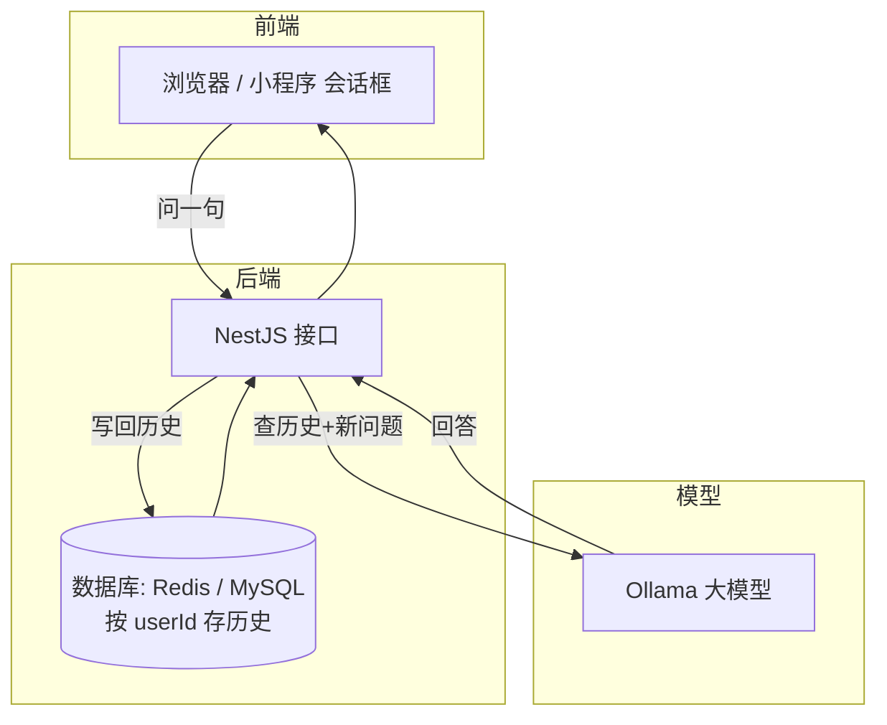

# Memory — 让大模型记起"刚才说了啥"

> **前置**：已完成 [NestJS + LangChain 集成与 Models 基础](/articles/nestjs-langchain-ai-app)
>
> **目标**：给大模型接上"记忆"，实现真正的多轮对话
>
> **技术栈**：NestJS + @langchain/ollama + ChatOllama（本地 qwen3.5:0.8b）

## 一、问题：大模型为什么不记事？

ChatGPT 用起来"记得你刚才说了什么"，但底层的大模型其实是**每次独立算账**的。

一句话解释：大模型本身是**没有状态的（stateless）**。你每一次调用 `invoke()`，都是把一堆消息丢给它，它按当前这批消息给你一个回答，然后……就忘了。

看这个现象——两次"单独调用"，第二次的"我叫小红"它完全不知道：



为什么会这样？因为两次 `invoke` 提交的消息互不相干。模型就像一个**每次见你都说"好久不见"的失忆同事**。

## 二、思路：记忆 = 把历史消息再带上

解决办法其实很简单：**前端把全部聊天记录，每次都一起发给模型**。



`invoke` 的参数本来就是**一个消息数组**。把上一次的输入输出都塞进数组里，模型就"想起"上文了。刚才的失忆同事，如果你每次都把上次的对话记录递给他看，他自然"记得"。

所以 Memory 的本质是：

::: tip 核心结论
**模型不记，我们帮它记。** 大模型 = 聪明的脑子；记忆 = 我们自己维护的一份"对话记录本"。调用前把记录本一起递进去。
:::

## 三、开始写：MemoryService

### 1. 生成模块

```bash
nest g module memory
nest g controller memory
nest g service memory
```

### 2. 完整代码：`memory.service.ts`

我们用 `Map` 做一个简单的"会话记录本"：`key` 是会话 id（`sessionId`），`value` 是这条会话的消息数组。

::: tip 面试常考点：原理一句话
大模型本身没有任何记忆。**记忆 = 我们在代码里手动维护消息历史，注入到每次调用中**。

- 用 `Map<sessionId, BaseMessage[]>` 存每个会话的历史
- 每次发消息：**取出历史 → 追加新消息 → 发给模型 → 把回复存回历史**
- `sessionId` 作为会话唯一标识，同一个 `sessionId` 共享一份历史
:::

```typescript
import { Injectable } from '@nestjs/common'
import { ChatOllama } from '@langchain/ollama'
import { HumanMessage, SystemMessage, AIMessage, BaseMessage } from '@langchain/core/messages'
import { Response } from 'express'
import { config } from '../config'

@Injectable()
export class MemoryService {
  private llm = new ChatOllama({
    model: config.ollama.chatModel,
    baseUrl: config.ollama.baseUrl,
    temperature: config.ollama.temperature,
  })

  // 会话记录本：sessionId -> 消息数组（BaseMessage 是消息的基类）
  private sessions = new Map<string, BaseMessage[]>()

  // 系统消息抽成实例属性，只创建一次，所有会话复用
  private systemMessage = new SystemMessage(
    '你是一个智能客服助手，请结合前面的对话上下文回答用户问题。',
  )

  // ---------- 基础：取历史，没有就新建 ----------
  private getOrCreate(sessionId: string): BaseMessage[] {
    if (!this.sessions.has(sessionId)) {
      // 新会话，初始化加入 systemMessage（限定角色）
      this.sessions.set(sessionId, [this.systemMessage])
    }
    return this.sessions.get(sessionId)!
  }

  // ---------- 1. 多轮对话（带记忆） ----------
  async chat(sessionId: string, message: string) {
    const history = this.getOrCreate(sessionId)

    // 把用户的新消息追加进历史
    history.push(new HumanMessage(message))

    // 把完整的历史发给模型（含 systemMessage + 历史消息 + 本次消息）
    const response = await this.llm.invoke(history)

    // 把模型的回复也存回历史 → 下一轮它就在上面了
    history.push(response)

    return {
      sessionId,
      message,
      reply: response.content,
      turns: Math.floor(history.length / 2), // 轮数：去掉 system 后 人机各一条算一轮
    }
  }

  // ---------- 2. 多轮对话（SSE 流式版本） ----------
  async chatStream(sessionId: string, message: string, res: Response) {
    res.setHeader('Content-Type', 'text/event-stream')
    res.setHeader('Cache-Control', 'no-cache')
    res.setHeader('Connection', 'keep-alive')
    res.setHeader('Access-Control-Allow-Origin', '*')

    const history = this.getOrCreate(sessionId)
    history.push(new HumanMessage(message))

    let fullReply = ''

    // 真实业务是"打字机"效果：一个字一个字往外蹦，不是一次性给 JSON
    const stream = await this.llm.stream(history)
    for await (const chunk of stream) {
      if (chunk.content) {
        const text = String(chunk.content)
        fullReply += text
        res.write(`data: ${JSON.stringify({ text, sessionId })}\n\n`)
      }
    }

    // 流结束后，把完整回复存回历史 —— 否则下一轮"忘了自己刚说什么"
    history.push(new AIMessage(fullReply))
    res.write(
      `data: ${JSON.stringify({ text: '[DONE]', turns: Math.floor((history.length - 1) / 2) })}\n\n`,
    )
    res.end()
  }

  // ---------- 3. 查看指定会话的历史（过滤掉 system，转成可读结构） ----------
  getHistory(sessionId: string) {
    const history = this.sessions.get(sessionId)
    if (!history) return { sessionId, exists: false, messages: [] }

    const messages = history
      .filter((m) => !(m instanceof SystemMessage)) // 系统消息不展示给用户
      .map((m, i) => ({
        index: i + 1,
        role: m instanceof HumanMessage ? 'user' : 'assistant',
        content: m.content,
      }))

    return {
      sessionId,
      exists: true,
      turns: Math.floor(messages.length / 2),
      messages,
    }
  }

  // ---------- 4. 清空会话（回到只有 system 的初始状态） ----------
  clearSession(sessionId: string) {
    if (!this.sessions.has(sessionId)) {
      return { sessionId, cleared: false, message: '会话不存在' }
    }
    // 重置为初始状态（保留 systemMessage），而不是整个删除
    this.sessions.set(sessionId, [this.systemMessage])
    return { sessionId, cleared: true, message: '会话已清空' }
  }

  // ---------- 5. 列出所有会话 ----------
  listSessions() {
    const sessions = Array.from(this.sessions.entries()).map(([id, h]) => ({
      sessionId: id,
      turns: Math.floor((h.length - 1) / 2), // 减掉 systemMessage 再算轮数
    }))
    return { total: sessions.length, sessions }
  }
}
```

### 3. 路由：`memory.controller.ts`

```typescript
import { Body, Controller, Delete, Get, Param, Post, Res } from '@nestjs/common'
import { Response } from 'express'
import { MemoryService } from './memory.service'

@Controller('memory')
export class MemoryController {
  constructor(private readonly memoryService: MemoryService) {}

  // POST /memory/chat
  @Post('chat')
  chat(@Body() body: { sessionId: string; message: string }) {
    return this.memoryService.chat(body.sessionId, body.message)
  }

  // POST /memory/chat-stream  （SSE 流式）
  @Post('chat-stream')
  chatStream(
    @Body() body: { sessionId: string; message: string },
    @Res() res: Response,
  ) {
    return this.memoryService.chatStream(body.sessionId, body.message, res)
  }

  // GET /memory/history/:sessionId
  @Get('history/:sessionId')
  getHistory(@Param('sessionId') sessionId: string) {
    return this.memoryService.getHistory(sessionId)
  }

  // DELETE /memory/session/:sessionId
  @Delete('session/:sessionId')
  clearSession(@Param('sessionId') sessionId: string) {
    return this.memoryService.clearSession(sessionId)
  }

  // GET /memory/sessions
  @Get('sessions')
  listSessions() {
    return this.memoryService.listSessions()
  }
}
```

### 4. 注册模块：`memory.module.ts`

```typescript
import { Module } from '@nestjs/common'
import { MemoryController } from './memory.controller'
import { MemoryService } from './memory.service'

@Module({
  controllers: [MemoryController],
  providers: [MemoryService],
})
export class MemoryModule {}
```

最后在 `app.module.ts` 的 `imports` 数组里加上 `MemoryModule`：

```typescript
imports: [
  // ...其他模块
  MemoryModule,
],
```

## 四、用 Apifox 验证"记忆"真的生效

核心测试：**同一 sessionId 连续问两轮**，看第二轮它是否记得第一轮的信息。

### 测试一：建立记忆

```
POST /memory/chat
{ "sessionId": "demo", "message": "请记住，我的名字叫小红" }
```

返回（节选）：
```json
{
  "sessionId": "demo",
  "reply": "你好，小红！我记住了你的名字。",
  "turns": 1
}
```

### 测试二：靠记忆回答（关键一步）

```
POST /memory/chat
{ "sessionId": "demo", "message": "我叫什么名字？" }
```

返回：
```json
{
  "sessionId": "demo",
  "reply": "你的名字叫小红！",
  "turns": 2
}
```

**能看到"小红"+全程没在第二次请求里提名字**，就说明记忆生效了。`turns` 从 1 涨到 2，说明历史确实在累积。

### 测试三：换个 sessionId = 失忆

```
POST /memory/chat
{ "sessionId": "other", "message": "我叫什么名字？" }
```

返回类似"我不知道/我们没有聊过名字"——因为换了新记录本，历史是空的。

### 测试四：查看 / 清空 / 列表

```
GET    /memory/history/demo     →  能看到完整对话记录（role: user/assistant）
GET    /memory/sessions         →  列出所有会话及其轮数
DELETE /memory/session/demo     →  清空后再问，又"失忆"了
```



## 五、真实业务里会怎么用？

上面用 `Map` 存历史（演示是模拟的、放内存里，重启服务就丢了），真实项目会分三层：



- **Redis**：会话历史是高频读写、带过期时间（比如 24h 无操作自动清空），非常适合存 Redis；
- **MySQL / PostgreSQL**：要长期沉淀、按用户查询统计时，存关系型数据库；
- 无论存哪，**思路都是上面那套**：取历史 → 拼上新问题 → 提交 → 把回答写回历史。

::: tip 对话的两种方式（面试常问）
真实的对话接口一般分两种返回方式：

| 方式 | 接口 | 特点 |
| --- | --- | --- |
| 一次性返回 | `POST /memory/chat` | 等模型整段想完，一次性给 JSON，实现最简单 |
| **流式返回（最常见）** | `POST /memory/chat-stream` | SSE 打字机效果，一个字一个字蹦，用户体验最好 |

工作中**绝大多数项目用的是流式**（你打开 ChatGPT 看到的就是它）。核心就是 `llm.stream()` + `res.write('data: ...')`，流结束后把完整回答补回历史——**别小看这一步，漏了它下一轮就"失忆"**。
:::

::: tip 学什么、不学什么
会话记忆本身不难：**就是个 Map + 上下文注入**。这类"简单的、写过就会的东西"，不要反复花时间学——会的东西直接复制粘贴用就行，省下时间学不会的。学习要**有选择性**：

- 已经会的 → 快速略过，直接复用
- 不会但常见常考的（如本节的 SSE 流式、`turns` 统计）→ 仔细学
- 工作中也一样：写过的代码直接复用，把精力花在新问题上
:::

::: tip 一句话总结
大模型的记忆不是模型自带的，而是**后端帮它存的对话历史**。核心代码就三行：读历史、提交历史+新问题、写回历史。
:::

下一篇，我们来解决大模型更严重的问题——**幻觉**（一本正经地胡说八道），这就是 [RAG 检索增强](/articles/nestjs-langchain-rag)。