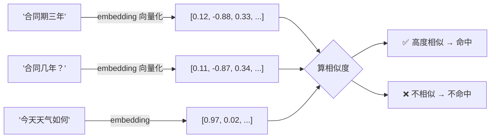
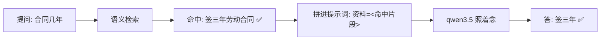

# RAG — 让大模型"翻书"再回答

> **前置**：已完成 [NestJS + LangChain 集成与 Models 基础](/articles/nestjs-langchain-ai-app)
> **目标**：把私有知识（文档、公司手册、FAQ）喂给大模型，让它**查资料后回答**，解决幻觉
> **技术栈**：NestJS + @langchain/ollama（qwen3.5:0.8b）+ mxbai-embed-large（向量模型）+ MemoryVectorStore

## 一、问题：大模型很聪明，但它会"瞎编"

直接问大模型"我们公司的物业合同是多少年"，它十有八九会一本正经地编一个数字——因为**它没看过你们公司的合同**。这就是**幻觉（Hallucination）**：模型不知道答案时，不会说"不知道"，而是基于训练数据"编一个最像的"。

解决思路不是让模型更聪明，而是**先把答案所在的那段资料搜出来，再让模型照着资料回答**。

```mermaid
flowchart LR
    subgraph 直接问（会编）
        A[问题: 公司合同几年] --> B[大模型凭记忆猜]
        B --> C[❌ 编一个数字]
    end
    subgraph RAG（先翻书）
        D[问题] --> E[检索知识库]
        E --> F[找到: 合同段资料]
        F --> G[模型照着资料回答]
        G --> H[✅ 引用真实内容]
    end
```

这个"先检索、后生成"的过程就叫 **RAG（Retrieval-Augmented Generation，检索增强生成）**。R 是检索，A 是增强，G 是生成——很直白。

## 二、RAG 全流程：两个阶段

RAG 分为**离线建库**和**在线问答**两个阶段。

```mermaid
flowchart LR
    subgraph 阶段一: 离线建知识库（一次做好的事）
        D[原始文档] --> S[分块 TextSplitter]
        S --> E[每块向量化 Embedding]
        E --> V[(向量数据库)]
    end
    subgraph 阶段二: 在线问答（每次提问做的事）
        Q[用户问题] --> E2[问题向量化]
        E2 --> V2{相似度检索}
        V2 -->|TopK 最相关块| C[找到资料片段]
        C --> P[拼进提示词]
        P --> M[大模型]
        M --> A[回答 ✅]
    end
    V -.-> V2
```

::: tip 好记的一句话
**建库是"把书抄成一张张索引卡"；问答是"先翻索引卡找到相关内容，再照着念"**。大模型全程没有接触整本书，只看到了和问题最相关的几段。
:::

## 三、三个核心组件详解（0 基础版）

RAG 落地全靠 LangChain 的三个组件，理解它们整件事就通了。

### 1. RecursiveCharacterTextSplitter — 把长文档切成小块

大模型单次能处理的内容有限，向量模型也有长度上限。一本书不能整本塞进提示词，**要切成一段一段的"卡片"**。切多大、切多碎，是 RAG 效果好坏的关键。

```typescript
import { RecursiveCharacterTextSplitter } from '@langchain/textsplitters'

const splitter = new RecursiveCharacterTextSplitter({
  chunkSize: 500,     // 每块目标长度（字符），超了就要另起一块
  chunkOverlap: 50,   // 相邻两块重叠 50 字符，避免一句话被从中间切断
})
```

- **chunkSize 太大**：检索到的是大段文字，提示词塞不下，还容易掺入无关内容 → 效果发散；
- **chunkSize 太小**：每块信息不完整，检索时语义被切碎 → 效果也差；
- **chunkOverlap 为什么需要**：一句话可能横跨两块边界，重叠一点保证这句话至少完整出现在某一块里。

"Recursive"（递归）的意思是：切分时先按**段落换行**切，切不动再用**句号**切，再不行按**空格/标点**逐级缩小。原因是**尽量保持语义完整**——按段落切出来的块最像"卡片"，硬按固定长度切会拦腰截断句子。

```mermaid
flowchart TD
    A[全文] -->|第1级: 分段符\n\n 切| B[段落们]
    B -.>|还不够小| C[第2级: 句号 。 切]
    C -.>|还不够小| D[第3级: 逗号标点切]
    D --> E[最终: 400-600字符的卡片们]
```

### 2. Document — 知识的最小单元（文本 + 备注）

"卡片"在 LangChain 里就是 `Document` 对象。它只有两个字段：

| 字段 | 是什么 | 例子 |
| --- | --- | --- |
| `pageContent` | 卡片里的正文 | "员工入职需签订为期三年的合同…" |
| `metadata` | 卡片的"身份证"（来源、页码、作者） | `{ source: '员工手册.pdf', page: 3 }` |

```typescript
import { Document } from '@langchain/core/documents'

const doc = new Document({
  pageContent: '员工入职需签订为期三年的合同…',
  metadata: { source: '员工手册.pdf', page: 3 },
})
```

metadata 很实用：回答时可以告诉用户"**这段答案出自《员工手册》第 3 页**"。

### 3. MemoryVectorStore + 向量化 — 把文字变成"可检索的数字"

计算机没法直接比较"哪句话最像哪句话"，所以要把文字变成**一串数字——向量**。步骤：

1. 用向量模型（我们装了 `mxbai-embed-large`）把每张卡片变成一串数字；
2. 用户提问时，把问题也变成数字；
3. 在向量库里找**数字最接近**的几张卡片（相似度检索）。



> 数字"像不像"就是句子的语义近不近。"合同期三年"和"合同几年"虽然措辞不同，但语义接近，所以向量也接近——这是传统关键词搜索做不到的。

## 四、完整代码：RAGService

### 1. 生成模块

```bash
nest g module rag
nest g controller rag
nest g service rag
```

### 2. `rag.service.ts` 完整实现

```typescript
import { Injectable } from '@nestjs/common'
import { ChatOllama, OllamaEmbeddings } from '@langchain/ollama'
import { RecursiveCharacterTextSplitter } from '@langchain/textsplitters'
import { MemoryVectorStore } from '@langchain/classic/vectorstores/memory'
import { Document } from '@langchain/core/documents'
import { ChatPromptTemplate } from '@langchain/core/prompts'
import { StringOutputParser } from '@langchain/core/output_parsers'
import { Response } from 'express'
import { config } from '../config'

@Injectable()
export class RagService {
  // 对话大模型
  private llm = new ChatOllama({
    model: config.ollama.chatModel,
    baseUrl: config.ollama.baseUrl,
    temperature: 0, // RAG 回答讲究准确，把温度调最低
  })

  // 向量化模型（把文字变成数字）
  private embeddings = new OllamaEmbeddings({
    model: config.ollama.embedModel, // mxbai-embed-large
    baseUrl: config.ollama.baseUrl,
  })

  // 内存向量库（存知识卡片的地方，重启服务会清空）
  private store: MemoryVectorStore | null = null

  // ---------- 1. 载入知识：分块 + 向量化 + 入库 ----------
  async loadKnowledge(text: string, metadata?: Record<string, any>) {
    // step1: 分块
    const splitter = new RecursiveCharacterTextSplitter({
      chunkSize: 500,
      chunkOverlap: 50,
    })
    const chunks = await splitter.splitText(text)

    // step2: 流转成 Document（带上来源备注）
    const docs = chunks.map(
      (chunk, index) =>
        new Document({
          pageContent: chunk,
          metadata: { ...metadata, chunk: index },
        }),
    )

    // step3: 向量化并存入内存向量库
    this.store = await MemoryVectorStore.fromDocuments(docs, this.embeddings)

    return {
      ok: true,
      chunkCount: docs.length, // 一共切成了几块卡片
      message: `知识已载入，共 ${docs.length} 个分块`,
    }
  }

  // ---------- 2. 检索：从知识库里找出最相关的块 ----------
  async search(query: string, k = 3) {
    if (!this.store) return { ok: false, message: '请先载入知识' }

    const results = await this.store.similaritySearch(query, k)
    return {
      ok: true,
      query,
      results: results.map((doc, i) => ({
        rank: i + 1,
        content: doc.pageContent,
        metadata: doc.metadata,
      })),
    }
  }

  // ---------- 3. 问答：检索 + 拼提示词 + 生成 ----------
  async query({ message }: { message: string }) {
    if (!this.store) return { ok: false, answer: '请先通过 /rag/load 载入知识' }

    // step1: 检索 Top3 相关卡片
    const results = await this.store.similaritySearch(message, 3)
    const context = results.map((doc) => doc.pageContent).join('\n\n')

    // step2: 拼提示词：只把检索到的碎片丢给模型
    const prompt = ChatPromptTemplate.fromMessages([
      [
        'system',
        '你是公司的知识库助手。请严格按照提供的资料回答问题，不要编造。\n如果资料里没有相关内容，请直接回答"公司资料中没有相关内容"。\n资料如下：\n{context}',
      ],
      ['human', '{question}'],
    ])

    const chain = prompt.pipe(this.llm).pipe(new StringOutputParser())
    const answer = await chain.invoke({ context, question: message })

    return { ok: true, question: message, answer, sources: results.length }
  }

  // ---------- 4. 问答（流式输出 SSE） ----------
  async queryStream({ message }: { message: string }, res: Response) {
    if (!this.store) {
      res.write('data: 请先通过 /rag/load 载入知识\n\n')
      res.end()
      return
    }

    const results = await this.store.similaritySearch(message, 3)
    const context = results.map((doc) => doc.pageContent).join('\n\n')

    const prompt = ChatPromptTemplate.fromMessages([
      [
        'system',
        '你是公司的知识库助手。请严格按照提供的资料回答问题，不要编造。\n资料如下：\n{context}',
      ],
      ['human', '{question}'],
    ])

    res.setHeader('Content-Type', 'text/event-stream')
    res.setHeader('Cache-Control', 'no-cache')
    res.setHeader('Connection', 'keep-alive')
    res.setHeader('Access-Control-Allow-Origin', '*')

    const stream = await prompt.pipe(this.llm).pipe(new StringOutputParser()).stream({
      context,
      question: message,
    })
    for await (const chunk of stream) {
      res.write(`data: ${JSON.stringify({ delta: chunk })}\n\n`)
    }
    res.write('data: [DONE]\n\n')
    res.end()
  }

  // ---------- 5. 查看状态 / 清空知识库 ----------
  status() {
    return {
      loaded: !!this.store,
      currentKnowledge: this.store ? '已载入，可回答知识库问题' : '空，请先载入',
    }
  }

  clear() {
    this.store = null
    return { ok: true, message: '知识库已清空' }
  }
}
```

::: warning 注意 MemoryVectorStore 的导入路径
LangChain 1.x 之后，`MemoryVectorStore` 移到了单独的 `@langchain/classic` 包：

```bash
pnpm install @langchain/classic
```

```typescript
import { MemoryVectorStore } from '@langchain/classic/vectorstores/memory'
```

如果你用的还是老版本写法 `langchain/vectorstores/memory`，会看到废弃提示或直接报错。
:::

### 3. `rag.controller.ts` 路由

```typescript
import { Body, Controller, Delete, Get, Post, Res, Query } from '@nestjs/common'
import { Response } from 'express'
import { RagService } from './rag.service'

@Controller('rag')
export class RagController {
  constructor(private readonly ragService: RagService) {}

  // POST /rag/load  { "text": "公司合同为三年…", "metadata": {"source":"员工手册"} }
  @Post('load')
  load(@Body() body: { text: string; metadata?: Record<string, any> }) {
    return this.ragService.loadKnowledge(body.text, body.metadata)
  }

  // GET /rag/search?query=合同几年&k=3
  @Get('search')
  search(@Query('query') query: string, @Query('k') k = 3) {
    return this.ragService.search(query, Number(k))
  }

  // POST /rag/query { "message": "公司合同几年？" }
  @Post('query')
  query(@Body() body: { message: string }) {
    return this.ragService.query(body)
  }

  // POST /rag/query-stream
  @Post('query-stream')
  queryStream(@Body() body: { message: string }, @Res() res: Response) {
    return this.ragService.queryStream(body, res)
  }

  // GET /rag/status
  @Get('status')
  status() {
    return this.ragService.status()
  }

  // DELETE /rag/clear
  @Delete('clear')
  clear() {
    return this.ragService.clear()
  }
}
```

在 `app.module.ts` 的 `imports` 里追加 `RagModule`。

## 五、用 Apifox 完整验证一次

### 第 1 步：载入知识

```
POST /rag/load
{
  "text": "公司成立于2010年。员工入职需签订为期三年的劳动合同。\n中秋节公司会发放节日礼盒。\n公司实行弹性工作制，每天工作8小时即可，上下班时间自由安排。\n公司地址位于北京市朝阳区。",
  "metadata": { "source": "员工手册" }
}
```

返回 `{ ok: true, chunkCount: ..., message: "知识已载入，共 N 个分块" }`——这说明知识已经被切块并向量化存好了。

### 第 2 步：看一眼检索到了什么

```
GET /rag/search?query=合同几年&k=3
```

返回里能看到命中"员工入职需签订为期三年的劳动合同"——**这句里根本没有"合同几年"这四个字，但它被检索出来**，因为语义相似。

### 第 3 步：提问（幻觉测试）

```
POST /rag/query { "message": "员工合同签几年？" }
```

它回答"三年"，并且这次回答的依据是资料，不是乱编：



### 第 4 步：反例验证——"不知道"就说不知道

```
POST /rag/query { "message": "公司年会举办了什么活动？" }
```

资料里没写年会，系统提示词里要求模型回答"公司资料中没有相关内容"——这就是 RAG 防幻觉的另一个价值：**不瞎编，老实承认不知道**。

## 六、检查清单：你的 RAG 为什么上班

| 环节 | 常见坑 | 怎么做 |
| --- | --- | --- |
| 分块 | 块太小语义碎 / 块太大塞不进提示词 | 500~1000 字符起步，配 10% 重叠 |
| 向量模型 | 用对话模型当向量模型（错） | 一定用 `mxbai-embed-large` 这类嵌入模型 |
| 检索 | 一次塞太多碎片，模型被带偏 | Top3 起步；资料长可加大 |
| 回答 | 模型仍想自由发挥 | system 提示词强调"只依据资料，禁止编造" |
| 存储 | 内存库重启就没了 | 生产用 PostgreSQL/Chroma 持久化（下一篇） |

::: tip 一句话总结
RAG = **把文档切成卡片 → 卡片向量化存起来 → 提问时先搜最像的卡片 → 让模型照着卡片回答**。它治的是大模型的"瞎编"，靠的是"先翻书再说话"。
:::

**下一篇 [三种向量存储方案与 pgvector 实操](/articles/nestjs-langchain-vectorstore)**：内存库重启就没，真正生产要用 PostgreSQL（pgvector）或 Chroma，手把手建表、插入、相似度检索。