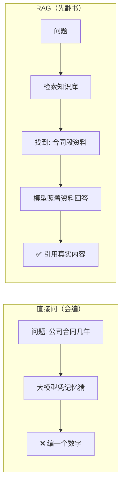
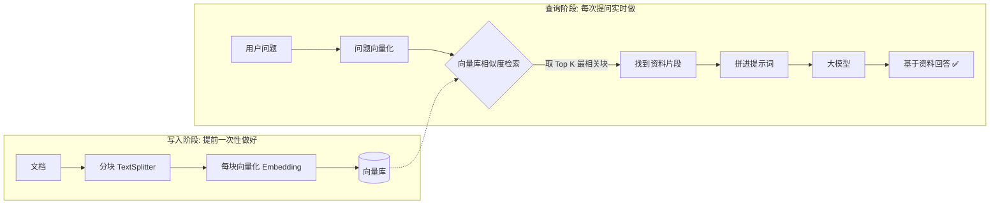
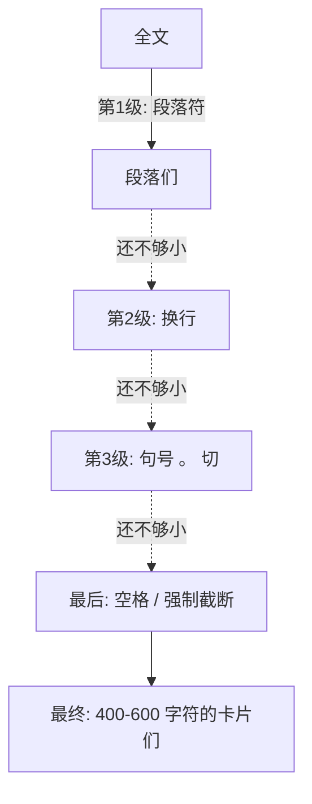
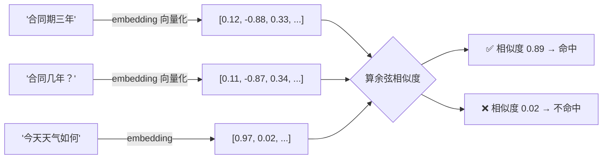
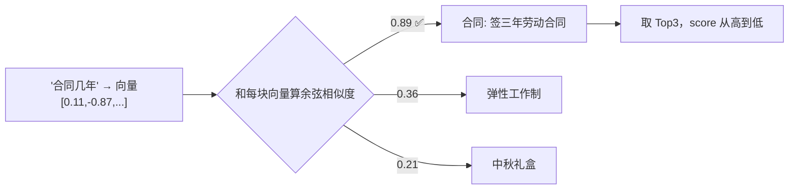
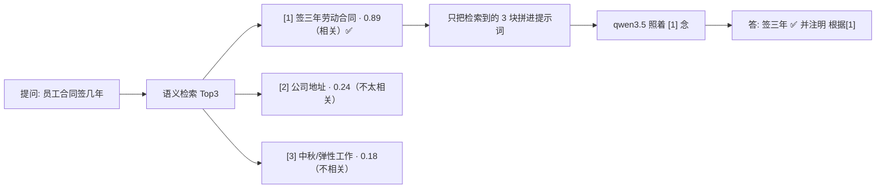

# RAG — 让大模型"翻书"再回答

> **前置**：已完成 [NestJS + LangChain 集成与 Models 基础](/articles/nestjs-langchain-ai-app)
>
> **目标**：把私有知识（文档、公司手册、FAQ）喂给大模型，让它**查资料后回答**，解决幻觉
>
> **技术栈**：NestJS + @langchain/ollama（qwen3.5:0.8b）+ mxbai-embed-large（向量模型）+ MemoryVectorStore

::: tip 重点中的重点
**RAG 检索增强**。无论是面试还是工作，只要把这块搞懂，就是"无敌"的存在——它划定了模型回答问题的范围：**让模型基于你提供的私有知识回答，而不是靠训练时学到的知识乱猜。**
:::

## 一、问题：大模型很聪明，但它会"瞎编"

直接问大模型"我们公司的物业合同是多少年"，它十有八九会一本正经地编一个数字——因为**它没看过你们公司的合同**。这就是**幻觉（Hallucination）**：模型不知道答案时，不会说"不知道"，而是基于训练数据"编一个最像的"。

解决思路不是让模型更聪明，而是**先把答案所在的那段资料搜出来，再让模型照着资料回答**。



这个"先检索、后生成"的过程就叫 **RAG（Retrieval-Augmented Generation，检索增强生成）**。R 是检索，A 是增强，G 是生成——很直白。

## 二、RAG 全流程：写入阶段 + 查询阶段

RAG 分为**写入阶段（提前）**和**查询阶段（实时）**两个阶段。



具体到接口流程：

```
写入阶段（提前）：
  文档 → 分块 → 向量化 → 存入向量库

查询阶段（实时）：
  用户问题 → 向量化 → 向量库检索 → 取 Top K 相关块
           → 拼入 Prompt → 模型基于资料回答
```

::: tip 好记的一句话
**建库是"把书抄成一张张索引卡"；问答是"先翻索引卡找到相关内容，再照着念"**。大模型全程没有接触整本书，只看到了和问题最相关的几段。我们**限定了模型回答问题的范围**，这样回答更有依据、更准确，幻觉自然就少了。
:::

::: warning 本文用内存向量库
本文用的是 **MemoryVectorStore（内存向量库）**：

| 优点 | 缺点 |
| --- | --- |
| 不需要启动 Chroma 服务，零配置 | **重启应用数据清空** |
| 上手最快，适合讲解原理 | 生产不持久化 |

生产环境换成 **pgvector（推荐，见第六节）** 或 Chroma，只改 `fromDocuments` 这一行 import，其余代码完全一样。
:::

## 三、三个核心组件详解（0 基础版）

RAG 落地全靠 LangChain 的三个组件，理解它们整件事就通了。

### 1. RecursiveCharacterTextSplitter — 把长文档切成小块

大模型单次能处理的内容有限，向量模型也有长度上限。一本书不能整本塞进提示词，**要切成一段一段的"卡片"**（Chunk）。切多大、切多碎，是 RAG 效果好坏的关键。

```typescript
import { RecursiveCharacterTextSplitter } from '@langchain/textsplitters'

const splitter = new RecursiveCharacterTextSplitter({
  chunkSize: 500,     // 每块最大字符数，超了就要另起一块
  chunkOverlap: 50,   // 相邻两块重叠 50 字符，防止语义被从中间切断

  // 分隔符优先级：从上到下依次尝试
  separators: [
    '\n\n',  // 第1优先：段落分隔（语义最完整）
    '\n',    // 第2优先：换行
    '。',    // 第3优先：中文句号
    '！', '？',
    ' ',     // 第4优先：空格（英文单词边界）
    '',      // 最后手段：强制按字符数截断
  ],
})
```

- **chunkSize 太大**：检索到的是大段文字，提示词塞不下，还容易掺入无关内容 → 效果发散；
- **chunkSize 太小**：每块信息不完整，检索时语义被切碎 → 效果也差；
- **chunkOverlap 为什么需要**：相邻块之间保留重叠内容，防止一个完整的语义被切割点截断。比如"请假需要**提前3天**，请在OA系统…"如果恰好在"3天"后面切断，下一块就丢失了"提前"这个关键上下文——overlap 50 个字符能把这条信息保留到下一块里。

为什么叫 "Recursive"（递归）？它按优先级依次尝试不同的分隔符：**优先用段落切，切完还太大就用换行切，再大就用句号切，以此类推**——这个"逐级降级"的过程就是递归的含义，目的是**尽量保持语义完整**：



### 2. Document — 知识的最小单元（文本 + 备注）

"卡片"在 LangChain 里就是 `Document` 对象。结构非常简单，只有两个字段：

| 字段 | 是什么 | 例子 |
| --- | --- | --- |
| `pageContent` | 卡片里的实际文字内容 | "员工入职需签订为期三年的合同…" |
| `metadata` | 卡片的"身份证"（来源、docId、页码） | `{ source: '员工手册.pdf', docId: 'doc-1', page: 3 }` |

```typescript
import { Document } from '@langchain/core/documents'

const doc = new Document({
  pageContent: '员工入职需签订为期三年的合同…',
  metadata: { source: '员工手册', docId: 'doc-1' },
})
```

**为什么需要 metadata？** 检索到相关内容后，用户不只想看到文字，还想知道"这段话来自哪里"。metadata 就是用来携带这些信息的——向量库返回的检索结果里，`doc.metadata` 直接告诉我们答案出处：

```typescript
const [doc, score] = results[0]

doc.pageContent  // '请假需要提前3天在OA系统提交申请...'
doc.metadata     // { source: '公司员工手册', docId: 'doc-001' }
score            // 0.8923（余弦相似度，越高越相关）
```

回答时候可以告诉用户"**这段答案出自《员工手册》第 3 页**"。

::: tip 分块时怎么用 createDocuments
`splitter.createDocuments(文本数组, metadata数组)` 返回 `Document[]`：每个文本切出的所有块，都会携带对应的 metadata。

```typescript
const chunks = await splitter.createDocuments(
  ['这是一篇很长的文章内容...'],           // 要切的文本
  [{ source: '公司手册', docId: 'doc-1' }], // 每块都会带这条 metadata
)
// chunks[0].pageContent → '文章内容的第一块（最多500字符）'
// chunks[0].metadata    → { source: '公司手册', docId: 'doc-1', loc: {...} }
```
:::

### 3. MemoryVectorStore + 向量化 — 把文字变成"可检索的数字"

计算机没法直接比较"哪句话最像哪句话"，所以要把文字变成**一串数字——向量**。我们用的 `mxbai-embed-large` 会把每句话变成 **1024 个数字**。

**内部工作流程：**

```
存入阶段（loadDocuments 时）：
  Document[]
    → embeddings.embedDocuments()  把每块文字转成数字向量
    → [[0.12, -0.34, 0.56, ...],   每个向量是 1024 个数字
       [0.78,  0.23, -0.11, ...],
       ...]
    → 存在内存数组里

检索阶段（search / query 时）：
  用户问题字符串
    → embeddings.embedQuery()      把问题也转成向量
    → [0.15, -0.31, 0.58, ...]
    → 和库里每个向量计算余弦相似度  数值越接近 1，语义越相关
    → 按相似度排序，返回前 topK 个
```



> 数字"像不像"就是句子的语义近不近。"合同期三年"和"合同几年"虽然措辞不同，但语义接近，所以向量也接近——这是传统关键词搜索做不到的。

**两个核心方法：**

```typescript
// 方法一：MemoryVectorStore.fromDocuments（静态方法，构建向量库）
// 传入 Document 数组 + embeddings 实例，自动完成向量化和存储
this.store = await MemoryVectorStore.fromDocuments(allDocs, this.embeddings)

// 方法二：similaritySearchWithScore（检索）
// 返回 [Document, score][] 数组，score 是余弦相似度（0~1，越高越相关）
const results = await this.store.similaritySearchWithScore('请假要提前几天？', 3)
// results[0] → [Document, 0.8923]  最相关
// results[1] → [Document, 0.4521]
// results[2] → [Document, 0.3102]  最不相关
```

## 四、完整代码：RAGService

### 1. 生成模块

```bash
nest g module rag
nest g controller rag
nest g service rag
```

### 2. `rag.service.ts` 完整实现

```typescript
import { Injectable } from '@nestjs/common'
import { ChatOllama, OllamaEmbeddings } from '@langchain/ollama'
import { RecursiveCharacterTextSplitter } from '@langchain/textsplitters'
import { MemoryVectorStore } from '@langchain/classic/vectorstores/memory'
import { Document } from '@langchain/core/documents'
import { ChatPromptTemplate } from '@langchain/core/prompts'
import { StringOutputParser } from '@langchain/core/output_parsers'
import { config } from '../config'

@Injectable()
export class RagService {
  // 对话大模型
  private llm = new ChatOllama({
    model: config.ollama.chatModel,
    baseUrl: config.ollama.baseUrl,
    temperature: 0, // RAG 回答讲究准确，把温度调最低
  })

  // 向量化模型（把文字变成数字，mxbai-embed-large → 1024 维）
  private embeddings = new OllamaEmbeddings({
    model: config.ollama.embedModel,
    baseUrl: config.ollama.baseUrl,
  })

  // 内存向量库（重启服务会清空）
  private store: MemoryVectorStore | null = null
  private docCount = 0 // 共载入几篇原始文档

  // ---------- 1. 写入阶段：分块 + 向量化 + 入库 ----------
  async loadDocuments(
    documents: { id: string; content: string; source?: string }[],
  ) {
    const splitter = new RecursiveCharacterTextSplitter({
      chunkSize: 500,
      chunkOverlap: 50,
      // 分隔符优先级：段落 → 换行 → 句号 → 空格 → 强制截断
      separators: ['\n\n', '\n', '。', '！', '？', ' ', ''],
    })

    // 每篇文档切成小块，统一收集成 Document[]
    const allDocs: Document[] = []
    for (const doc of documents) {
      const chunks = await splitter.createDocuments(
        [doc.content],
        [{ source: doc.source || doc.id, docId: doc.id }], // 每块都带来源
      )
      allDocs.push(...chunks)
    }

    // 向量化并存入内存向量库
    this.store = await MemoryVectorStore.fromDocuments(allDocs, this.embeddings)
    this.docCount = documents.length

    return {
      ok: true,
      docCount: documents.length,
      totalChunks: allDocs.length,
      message: `已载入 ${documents.length} 篇文档，共 ${allDocs.length} 个分块`,
    }
  }

  // ---------- 2. 检索：找出最相关的 Top K 块（不过大模型） ----------
  async search(query: string, topK = 3) {
    if (!this.store) return { ok: false, message: '请先通过 /rag/load 载入知识' }

    const results = await this.store.similaritySearchWithScore(query, topK)
    return {
      ok: true,
      query,
      results: results.map(([doc, score], i) => ({
        rank: i + 1,
        content: doc.pageContent,
        source: doc.metadata.source,
        score: parseFloat(score.toFixed(4)), // 余弦相似度，越高越相关
      })),
    }
  }

  // ---------- 3. 查询阶段：检索 + 拼提示词 + 生成 ----------
  async query(question: string, topK = 3) {
    if (!this.store) {
      return { ok: false, answer: '请先通过 /rag/load 载入知识' }
    }

    // Step 1：检索最相关的文档块
    const retrieved = await this.store.similaritySearchWithScore(question, topK)
    if (!retrieved.length) {
      return { ok: true, question, answer: '知识库中未找到相关内容', sources: [] }
    }

    // Step 2：把检索到的块拼成 context 字符串
    // [1] 第一块内容\n\n[2] 第二块内容...
    // 编号方便模型回答时引用："根据[1]..."
    const context = retrieved
      .map(([doc], i) => `[${i + 1}] ${doc.pageContent}`)
      .join('\n\n')

    // Step 3：RAG Prompt —— 严格限定模型只能用参考资料回答
    const prompt = ChatPromptTemplate.fromMessages([
      [
        'system',
        `你是知识库问答助手，严格基于以下参考资料回答问题。

规则：
1. 只根据参考资料内容回答，不能使用资料外的知识
2. 如果资料中没有相关信息，回答"知识库中暂无相关内容"
3. 回答简洁准确，使用中文
4. 可以说明答案来自第几条参考资料

参考资料：
{context}`,
      ],
      ['human', '{question}'],
    ])

    // Step 4：调用模型生成回答
    const chain = prompt.pipe(this.llm).pipe(new StringOutputParser())
    const answer = await chain.invoke({ context, question })

    return {
      ok: true,
      question,
      answer,
      sources: retrieved.map(([doc, score]) => ({
        content: doc.pageContent,
        source: doc.metadata.source,
        score: parseFloat(score.toFixed(4)),
      })),
    }
  }

  // ---------- 4. 查看状态 / 清空知识库 ----------
  status() {
    return {
      loaded: !!this.store,
      docCount: this.docCount,
      message: this.store ? `知识库已载入 ${this.docCount} 篇文档` : '知识库为空，请先载入',
    }
  }

  clear() {
    this.store = null
    this.docCount = 0
    return { ok: true, message: '知识库已清空' }
  }
}
```

::: warning 注意 MemoryVectorStore 的导入路径
LangChain 1.x 之后，`MemoryVectorStore` 移到了单独的 `@langchain/classic` 包：

```bash
pnpm install @langchain/classic
```

```typescript
import { MemoryVectorStore } from '@langchain/classic/vectorstores/memory'
```

如果你用的还是老版本写法 `langchain/vectorstores/memory`，会看到废弃提示或直接报错。
:::

### 3. `rag.controller.ts` 路由

```typescript
import { Body, Controller, Delete, Get, Post } from '@nestjs/common'
import { RagService } from './rag.service'

@Controller('rag')
export class RagController {
  constructor(private readonly ragService: RagService) {}

  // POST /rag/load → 写入阶段：一次性载入多篇文档
  @Post('load')
  loadDocuments(
    @Body() body: { documents: { id: string; content: string; source?: string }[] },
  ) {
    return this.ragService.loadDocuments(body.documents)
  }

  // POST /rag/search → 纯向量检索（不过大模型）
  @Post('search')
  search(@Body() body: { query: string; topK?: number }) {
    return this.ragService.search(body.query, body.topK)
  }

  // POST /rag/query → 完整 RAG 问答（检索 + 生成）
  @Post('query')
  query(@Body() body: { question: string; topK?: number }) {
    return this.ragService.query(body.question, body.topK)
  }

  // GET /rag/status → 知识库状态
  @Get('status')
  status() {
    return this.ragService.status()
  }

  // DELETE /rag/clear → 清空知识库
  @Delete('clear')
  clear() {
    return this.ragService.clear()
  }
}
```

在 `app.module.ts` 的 `imports` 里追加 `RagModule`。

## 五、用 Apifox 完整验证一次

### 第 1 步：写入阶段 — 载入多篇文档

```
POST /rag/load
{
  "documents": [
    { "id": "doc-1", "content": "公司成立于2010年，员工入职需签订为期三年的劳动合同。", "source": "员工手册" },
    { "id": "doc-2", "content": "中秋节公司会发放节日礼盒。公司实行弹性工作制，每天工作8小时即可，上下班时间自由安排。", "source": "员工手册" },
    { "id": "doc-3", "content": "公司地址位于北京市朝阳区。", "source": "员工手册" }
  ]
}
```

返回 `{ ok: true, docCount: 3, totalChunks: ..., message: "已载入 3 篇文档，共 N 个分块" }`——文档已经被切块、向量化、存好了。

### 第 2 步：看一眼检索到了什么（带相似度分数）

```
POST /rag/search { "query": "合同几年", "topK": 3 }
```

返回示例：

```json
{
  "ok": true,
  "query": "合同几年",
  "results": [
    {
      "rank": 1,
      "content": "公司成立于2010年，员工入职需签订为期三年的劳动合同。",
      "source": "员工手册",
      "score": 0.8923
    },
    {
      "rank": 2,
      "content": "公司实行弹性工作制，每天工作8小时即可，上下班时间自由安排。",
      "source": "员工手册",
      "score": 0.3587
    },
    {
      "rank": 3,
      "content": "中秋节公司会发放节日礼盒。",
      "source": "员工手册",
      "score": 0.2102
    }
  ]
}
```

**每个字段是什么意思：**

| 字段 | 含义 |
| --- | --- |
| `rank` | 相关度排名，1 最相关，按 score 从高到低排 |
| `content` | 命中的文档块（检索到的知识卡片原文） |
| `source` | 这块来自哪篇文档（load 时传的 source metadata） |
| `score` | **余弦相似度（0~1），越高越相关**，是排名的依据 |

**为什么没写"合同几年"这四个字也能命中？**

第 1 名命中的是"…签订**为期三年**的**劳动合**同"——字面上一个"合同几年"都没有，但 `score` 高达 0.89：因为检索时把问题"合同几年"转成向量，再和每块文档的向量算余弦相似度，"合同/合同""几年/三年"语义相近，向量就贴得很近。这就是**语义检索**，关键词搜索做不到这一点，也是 RAG 的核心。

再对比第 2、3 名：弹性工作、中秋礼盒和"合同"语义毫不相干，score 只有 0.35、0.21，被排到后面。**分越高排越前，只有真正相关的块才会被拼进后面的 Prompt。**



### 第 3 步：提问（幻觉测试）

```
POST /rag/query { "question": "员工合同签几年？" }
```

返回示例：

```json
{
  "ok": true,
  "question": "员工合同签几年？",
  "answer": "根据[1]，公司员工入职签订的是为期三年（3 年）的劳动合同。",
  "sources": [
    {
      "content": "公司成立于2010年，员工入职需签订为期三年的劳动合同。",
      "source": "员工手册",
      "score": 0.8876
    },
    {
      "content": "公司地址位于北京市朝阳区。",
      "source": "员工手册",
      "score": 0.2419
    },
    {
      "content": "中秋节公司会发放节日礼盒。公司实行弹性工作制，每天工作8小时即可，上下班时间自由安排。",
      "source": "员工手册",
      "score": 0.1831
    }
  ]
}
```

**关键在看 `answer` 和 `sources` 的对应关系：**

| 字段 | 含义 |
| --- | --- |
| `answer` | 模型的最终回答，注意开头是"根据[1]…" |
| `sources` | **回答的依据**——命中的资料块 + 来源 + 分数，用来校验有没有瞎编 |

回答里的"**根据[1]**"，正是 Prompt 里给每块资料编号（`[1]` `[2]` `[3]`）后的效果：只有第 1 名（分数 0.89）和问题真正相关，模型就只引用它；第 2、3 名分数太低，直接忽略。**`answer` 里引用了哪条，`sources` 里就有对应那条——回答全程有迹可循，这就是"不编"的证据。**



::: tip 它怎么保证不乱编？
模型在**查询阶段全程没看"员工手册"这本书**，只看到了检索出来的 3 块卡片。所以回答"三年"不是凭空想出来的，而是资料里确实写了，再照着念出来。
:::

### 第 4 步：反例验证——"不知道"就说不知道

```
POST /rag/query { "question": "公司年会举办了什么活动？" }
```

返回示例：

```json
{
  "ok": true,
  "question": "公司年会举办了什么活动？",
  "answer": "知识库中暂无相关内容",
  "sources": []
}
```

**为什么它老实说"不知道"？**

1. 检索还是会跑：把"公司年会举办了什么活动"向量化，去库里找最像的 3 块——但库里只有合同、弹性工作、中秋、公司地址，和"年会"压根不沾边，捞上来的都是低分垃圾；
2. 这些废话零碎拼进 Prompt 后，系统提示词**规则 2** 出手："如果资料中没有相关信息，回答『知识库中暂无相关内容』"，模型判断资料里确实没有年会的信息，于是不编造、直接承认；
3. 这就是 RAG 防幻觉的另一个价值：**不瞎编，老实承认不知道**。换个没 RAG 的普通大模型，它很可能会一本正经编出一套"年会互动游戏方案"。

::: tip 进阶：更严格的"兜底"拦截
上面的回答靠模型自觉（规则 2）。如果想让代码更硬核，可以在检索后**按分数阈值过滤**，分数太低直接短路，不调用模型：

```typescript
const retrieved = await this.store.similaritySearchWithScore(question, topK)
const relevant = retrieved.filter(([, score]) => score > 0.5) // 低于 0.5 视为无关

if (!relevant.length) {
  return { ok: true, question, answer: '知识库中暂无相关内容', sources: [] }
}
```
:::

## 六、存储方案怎么选：演示用内存库，生产推荐 pgvector

::: tip 一句话结论
**演示 / 学习用 MemoryVectorStore，真实线上环境推荐用 pgvector（PostgreSQL 插件）。**
:::

| 场景 | 用哪个 | 原因 |
| --- | --- | --- |
| 学习 / Demo / 原型 | `MemoryVectorStore` | 零安装零配置，不用启动服务，上手最快；但数据存在**内存**：**服务一重启（刷新/重启应用）数据就没了**，再次提问会提示"请先载入知识"，需要重新 `POST /rag/load` |
| **生产首选** | **pgvector** | 装在你已有的 PostgreSQL 里，一个扩展搞定持久化；还能和业务数据放**同一张表联合查询**（如"只检索某用户上传的文档"，向量相似度 + 普通字段过滤一条 SQL 完成） |
| 纯向量海量场景 | Chroma 等专用向量库 | 千万级数据、团队无 PostgreSQL 经验时再考虑 |

**为什么生产优先推荐 pgvector（而不是 Chroma）：**

1. **不用多维护一个服务**——pgvector 是 PostgreSQL 的插件，`CREATE EXTENSION vector` 就能用；Chroma 要单独部署一个容器，多一套监控、备份、升级的运维成本；
2. **业务数据 + 向量同库**——你的库里已经有用户、文章等业务数据，pgvector 可以把向量和业务数据放同一张表做联合查询（比如"只检索某用户上传的文档"一条 SQL 搞定），Chroma 做不到；
3. **成熟稳定**——PostgreSQL 本身非常成熟，生产事故极少；Chroma 2022 年才发布，生产案例相对少。

**什么时候才考虑 Chroma / 专用向量库：** 向量数据过千万级要极致检索性能、团队没有 PostgreSQL 经验只想要开箱即用的存储、业务场景纯粹是"只按向量检索"不需要和关系型数据联合查询。**大多数业务根本到不了这个量级，pgvector 完全够用。**

### 切换成本：Memory → PGVector 只改 2~3 行

| 改动范围 | 要不要改 |
| --- | --- |
| `rag.service.ts` 的 `fromDocuments` 和初始化方式 | ✅ 只改这 2~3 行 |
| `similaritySearchWithScore()` 调用 | ❌ 完全不用改 |
| `query` / `search` 拼 Prompt、调模型的逻辑 | ❌ 完全不用改 |
| `rag.controller.ts` | ❌ 完全不用改 |

右侧是换库后的核心差异，只有 `fromDocuments` 这一行不同，其余代码一模一样：

```typescript
// MemoryVectorStore（现在，演示用）
import { MemoryVectorStore } from '@langchain/classic/vectorstores/memory'
this.store = await MemoryVectorStore.fromDocuments(allDocs, this.embeddings)

// PGVectorStore（生产换这个，数据落盘、重启不丢）
import { PGVectorStore } from '@langchain/community/vectorstores/pgvector'
this.store = await PGVectorStore.fromDocuments(allDocs, this.embeddings, {
  postgresConnectionOptions: { connectionString: process.env.DATABASE_URL },
  tableName: 'documents',
  columns: {
    idColumnName: 'id',
    vectorColumnName: 'embedding',
    contentColumnName: 'content',
    metadataColumnName: 'metadata',
  },
})
```

建表、迁移、HNSW 索引等实操细节，全部在[下一篇](/articles/nestjs-langchain-vectorstore)里手把手完成。

## 七、检查清单：你的 RAG 为什么"上班"

| 环节 | 常见坑 | 怎么做 |
| --- | --- | --- |
| 分块 | 块太小语义碎 / 块太大塞不进提示词 | 500~1000 字符起步，配 10% 重叠 |
| 向量模型 | 用对话模型当向量模型（错） | 一定用 `mxbai-embed-large` 这类嵌入模型 |
| 检索 | 一次塞太多碎片，模型被带偏 | Top3 起步；资料长可加大 |
| 回答 | 模型仍想自由发挥 | system 提示词强调"只依据资料，禁止编造"，并让它引用"第几条参考资料" |
| 存储 | 内存库重启就没了 | 生产 **推荐 pgvector**（用已有 PostgreSQL 装了就能用），见[下一篇](/articles/nestjs-langchain-vectorstore) |

::: tip 一句话总结
RAG = **把文档切成卡片 → 卡片向量化存起来 → 提问时先搜最像的 TopK 卡片 → 让模型照着卡片回答**。它治的是大模型的"瞎编"，靠的是"先翻书再说话"。换存储方案（Memory → PGVector / Chroma）只需改 `fromDocuments` 一行，业务代码几乎不变——这是 LangChain 抽象层的价值。
:::

**下一篇 [RAG 向量存储三种方案完整实操](/articles/nestjs-langchain-vectorstore)**：MemoryVectorStore / PGVector / Chroma 三份可直接跑的完整代码，安装步骤、数据库验证、Apifox 测试，换方案只替换 `rag.service.ts`。