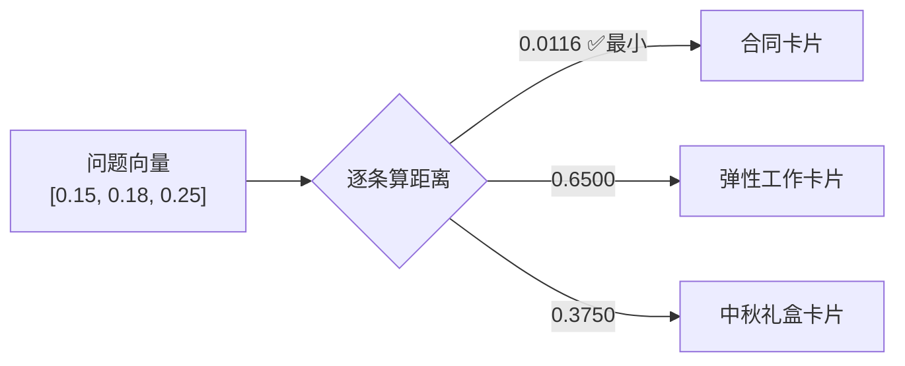
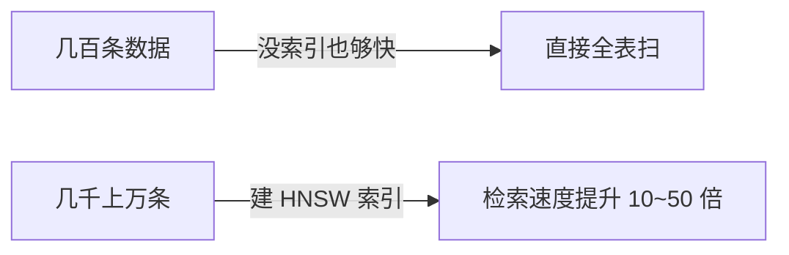
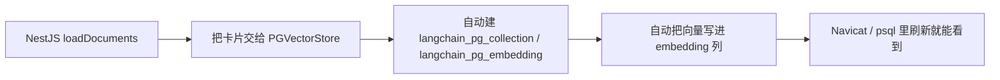
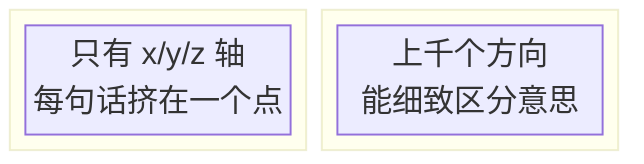

# RAG 向量存储：三种方案完整实操

> **前置**：已完成 [RAG 检索增强](/articles/nestjs-langchain-rag)
>
> **目标**：把 RAG 的知识库从"内存"升级到"数据库"。三种方案（MemoryVectorStore / PGVector / Chroma）各给一份**可直接跑的完整代码**，接口完全一致，**换方案只替换 `rag.service.ts`**，其余文件全不动
>
> **技术栈**：NestJS + @langchain/ollama（qwen3.5:0.8b + mxbai-embed-large）+ @langchain/classic + @langchain/community + PostgreSQL + pgvector / Chroma

## 一、为什么不能一直用内存向量库？

上一篇的 `MemoryVectorStore` 是把知识卡片存在**内存**里：

| 优点 | 缺点 |
| --- | --- |
| 零安装、零配置，上手最快 | 重启服务知识全丢 |
| 适合 demo / 学习 | 数据一多内存吃紧 |
| 单机演示足够 | 无法多服务共享、无法持久化 |

真实业务里，知识库（合同、售后、商品资料）是**长期资产**，必须存到数据库。这篇文章给出三种主流向量存储方案：

- **方案一：MemoryVectorStore**——内存版，零配置，学习演示用；
- **方案二：PGVector**——PostgreSQL 插件，**推荐生产方案**，可持久化 + 和业务数据联合查询；
- **方案三：Chroma**——独立向量数据库，需要单独启动服务，适合纯向量场景。

## 二、三种方案对比（先看结论）

| 对比项 | MemoryVectorStore | PGVector | Chroma |
| --- | --- | --- | --- |
| 安装复杂度 | ⭐ 零配置 | ⭐⭐ 需启用扩展 | ⭐⭐⭐ 需启动独立服务 |
| 数据持久化 | ❌ 重启清空 | ✅ 永久保存 | ✅ 永久保存 |
| 额外服务 | 无 | 无（复用 PostgreSQL） | 需要 Chroma Server |
| 和业务数据联合查询 | ❌ | ✅ SQL + 向量 | ❌ |
| 事务支持 | ❌ | ✅ ACID 完整 | ❌ |
| 适用场景 | 学习演示 | **推荐生产方案** | 纯向量场景 |
| npm 包 | `@langchain/classic` | `@langchain/community` + `pg` + `uuid` | `@langchain/community` + `chromadb` |

::: tip 一句话结论
**演示 / 学习用 MemoryVectorStore，真实线上环境推荐用 pgvector（PostgreSQL 插件）**。Chroma 只在海量纯向量、无业务数据关联时才考虑。
:::

## 三、方案一：MemoryVectorStore（内存）

**特点**：零配置，开箱即用，数据保存在内存，**重启应用后清空**。

### 1. 安装

```bash
npm install @langchain/classic
```

### 2. `rag.service.ts` 完整代码

```typescript
// src/rag/rag.service.ts
// 方案一：MemoryVectorStore（内存向量库）

import { Injectable } from '@nestjs/common'
import { ChatOllama, OllamaEmbeddings } from '@langchain/ollama'
import { ChatPromptTemplate } from '@langchain/core/prompts'
import { StringOutputParser } from '@langchain/core/output_parsers'
import { RecursiveCharacterTextSplitter } from '@langchain/textsplitters'
import { Document } from '@langchain/core/documents'
// ⚠️ 注意：必须从 @langchain/classic 导入，不是 langchain/vectorstores/memory
import { MemoryVectorStore } from '@langchain/classic/vectorstores/memory'
import { config } from '../config'

@Injectable()
export class RagService {
  private llm = new ChatOllama({
    model: config.ollama.chatModel,
    baseUrl: config.ollama.baseUrl,
    temperature: 0.1,
    think: false,
    numPredict: 1024,
  })

  private embeddings = new OllamaEmbeddings({
    model: config.ollama.embedModel, // mxbai-embed-large
    baseUrl: config.ollama.baseUrl,
  })

  // 内存向量库实例（null = 未初始化）
  private vectorStore: MemoryVectorStore | null = null
  private docCount = 0

  // ── 加载文档 ───────────────────────────────────────────
  async loadDocuments(documents: { id: string; content: string; source?: string }[]) {
    const splitter = new RecursiveCharacterTextSplitter({
      chunkSize: 500,
      chunkOverlap: 50,
      separators: ['\n\n', '\n', '。', '！', '？', ' ', ''],
    })

    const allDocs: Document[] = []
    for (const doc of documents) {
      const chunks = await splitter.createDocuments(
        [doc.content],
        [{ source: doc.source || doc.id, docId: doc.id }],
      )
      allDocs.push(...chunks)
    }

    // fromDocuments：批量向量化并存入内存
    this.vectorStore = await MemoryVectorStore.fromDocuments(allDocs, this.embeddings)
    this.docCount = documents.length

    return {
      success: true,
      originalDocs: documents.length,
      totalChunks: allDocs.length,
      message: `加载 ${documents.length} 篇文档，共 ${allDocs.length} 个块（内存存储）`,
    }
  }

  // ── 纯向量检索 ─────────────────────────────────────────
  async search(query: string, topK = 3) {
    if (!this.vectorStore) return { error: '请先调用 /rag/load 加载文档' }

    const results = await this.vectorStore.similaritySearchWithScore(query, topK)
    return {
      query,
      results: results.map(([doc, score]) => ({
        content: doc.pageContent,
        source: doc.metadata.source,
        score: parseFloat(score.toFixed(4)), // 余弦相似度，越高越相关
      })),
    }
  }

  // ── 完整 RAG 问答 ──────────────────────────────────────
  async query(question: string, topK = 3) {
    if (!this.vectorStore) return { error: '请先调用 /rag/load 加载文档' }

    const retrieved = await this.vectorStore.similaritySearchWithScore(question, topK)
    if (!retrieved.length) return { question, answer: '知识库中没有找到相关内容', sources: [] }

    const context = retrieved.map(([doc], i) => `[${i + 1}] ${doc.pageContent}`).join('\n\n')

    const prompt = ChatPromptTemplate.fromMessages([
      [
        'system',
        `你是知识库问答助手，严格基于参考资料回答。
规则：
1. 只根据参考资料内容回答，不能使用资料外的知识
2. 资料中没有相关信息，回答"知识库中暂无相关内容"
3. 回答简洁准确，使用中文

参考资料：
{context}`,
      ],
      ['human', '{question}'],
    ])

    const chain = prompt.pipe(this.llm).pipe(new StringOutputParser())
    const answer = await chain.invoke({ context, question })

    return {
      question,
      answer,
      sources: retrieved.map(([doc, score]) => ({
        content: doc.pageContent,
        source: doc.metadata.source,
        score: parseFloat(score.toFixed(4)),
      })),
    }
  }

  // ── 查看状态 / 清空 ────────────────────────────────────
  getStatus() {
    return {
      mode: 'MemoryVectorStore',
      loaded: !!this.vectorStore,
      docCount: this.docCount,
      message: this.vectorStore ? `已加载 ${this.docCount} 篇文档（内存）` : '知识库为空',
    }
  }

  clearKnowledge() {
    this.vectorStore = null
    this.docCount = 0
    return { success: true, message: '内存知识库已清空' }
  }
}
```

::: warning 重启数据就没了
Memory 方案把向量存在 JS 内存数组里，**重启 / 刷新应用后数据全部清空**，再提问会提示"请先调用 /rag/load 加载文档"，需要重新 load 一次。这就是要升级到下面的硬盘存储的原因。
:::

## 四、方案二：PGVector（PostgreSQL，推荐生产）

**特点**：直接复用已有 PostgreSQL，不加新服务，数据持久化，支持向量 + SQL 联合查询。

### 1. 安装依赖

```bash
# @langchain/community 已安装，只需补装 uuid
npm install uuid
npm install @types/uuid --save-dev
```

### 2. 在 PostgreSQL 里启用 pgvector 扩展

```bash
# 连接数据库
psql -U postgres -h localhost -d nest_demo

# 启用 pgvector 扩展（只需执行一次）
CREATE EXTENSION IF NOT EXISTS vector;

# 验证安装成功
SELECT * FROM pg_extension WHERE extname = 'vector';

# 退出
\q
```

注意：pgvector 是 PostgreSQL 的扩展插件，PostgreSQL 18 需要单独安装 pgvector。

```bash
# macOS：Homebrew 安装
brew install pgvector
psql -U postgres -d nest_demo -c "CREATE EXTENSION IF NOT EXISTS vector;"
```

```bash
# Linux（Ubuntu）：编译安装
sudo apt install -y postgresql-server-dev-18 build-essential git
git clone https://github.com/pgvector/pgvector.git
cd pgvector
make
sudo make install
psql -U postgres -d nest_demo -c "CREATE EXTENSION IF NOT EXISTS vector;"
```

**Windows**：去 https://github.com/pgvector/pgvector/releases 下载对应 PostgreSQL 版本的安装包，双击安装，然后执行：

```sql
CREATE EXTENSION IF NOT EXISTS vector;
```

### 3. Navicat 手把手实操（先弄懂原理）

很多同学习惯用可视化工具（如 **Navicat**）操作数据库。我们先**不写代码**，跟着步骤把向量表建出来、填数据、检查，把概念吃透，再切回 LangChain 代码。

**第 1 步：创建数据库和 vector 扩展**

用 Navicat 连上本地 PostgreSQL（docker 起的库默认库名 `postgres`，端口 `5432`）。新建一个数据库 `langchain_demo`，打开查询工具执行：

```sql
-- 开启 pgvector 扩展（库只需执行一次）
CREATE EXTENSION IF NOT EXISTS vector;

-- 确认扩展装好了
SELECT extname, extversion FROM pg_extension WHERE extname = 'vector';
```

**第 2 步：建表（表结构是精髓）**

```sql
CREATE TABLE documents (
  id         SERIAL PRIMARY KEY,      -- 自增主键
  content    TEXT NOT NULL,           -- 分块后的文本（知识卡片正文）
  metadata   JSONB,                   -- 可选：来源、页码等备注
  embedding  vector(3) NOT NULL       -- 向量列！(3) 表示 3 维
);
```

核心就是这一列：**`embedding vector(3)`**。`(3)` 是向量的维度（为什么是 3，第八节专门讲），这里先用 3 维方便手算。

**第 3 步：手动插入向量数据**

```sql
-- 插入三条"知识卡片"，注意 embedding 是 [数字,数字,数字] 这种写法
INSERT INTO documents (content, metadata, embedding) VALUES
  ('员工入职需签订为期三年的劳动合同', '{"source":"员工手册"}', '[0.1, 0.2, 0.3]'),
  ('中秋节公司发放节日礼盒',          '{"source":"员工手册"}', '[0.6, 0.7, 0.8]'),
  ('公司实行弹性工作制',              '{"source":"员工手册"}', '[0.9, 0.1, 0.4]');
```

**第 4 步：用余弦相似度检索最相近的卡片 —— RAG 问答的核心**

把用户的问题变成一个向量（比如 `[0.15, 0.18, 0.25]`，语义上接近"合同"），然后到数据库里找**和它最像**的行。pgvector 的 `<=>` 运算符计算余弦距离（**越小越像**）：

```sql
-- 找到与向量 [0.15, 0.18, 0.25] 最接近的 3 条卡片
SELECT content, embedding, embedding <=> '[0.15, 0.18, 0.25]' AS distance
FROM documents
ORDER BY embedding <=> '[0.15, 0.18, 0.25]'
LIMIT 3;
```



结果里**距离最小的就是"合同"那张卡**，说明语义检索成功了。

**第 5 步：更新和删除（维护知识库）**

```sql
-- 改一条卡片的正文和向量
UPDATE documents
SET content = '员工入职需签订为期五年的劳动合同', embedding = '[0.11, 0.21, 0.31]'
WHERE id = 1;

-- 删一条卡片
DELETE FROM documents WHERE id = 3;

-- 统计知识库有多少张卡
SELECT COUNT(*) FROM documents;
```

### 4. 自动建表：LangChain 帮你做的事

上面是用 Navicat 手工建的表（`documents`），用于理解原理。**实际生产里用 `PGVectorStore` 时，表会自动创建，不用你手写建表 SQL**——它默认建两张表：

```sql
-- PGVectorStore 自动创建，无需手动执行
CREATE TABLE langchain_pg_collection (
  uuid UUID PRIMARY KEY,
  name TEXT,                  -- collection 名称（类似"库名"）
  cmetadata JSONB
);

CREATE TABLE langchain_pg_embedding (
  id           UUID PRIMARY KEY,
  collection_id UUID REFERENCES langchain_pg_collection(uuid),
  embedding    vector,        -- 向量数据
  document     TEXT,          -- 文档内容
  cmetadata    JSONB          -- 元数据（source、docId 等）
);
```

`collection` 的概念类似"表的名字空间"：一个 collection 是一个独立的知识库。写代码时指定 `collectionName: 'rag-knowledge-base'`，LangChain 就自动把数据归到这一个"库"下面。

### 5. 配套 HNSW 索引（数据多到几千条再上）

数据很少时挨个比就行；当知识库到了上千条，全表扫描会很慢。pgvector 支持 **HNSW 索引**（一种高效"找最近邻居"的算法，能大幅提速上限几十倍）：

```sql
-- 给向量列建 HNSW 索引，距离函数和查询时一致即可
CREATE INDEX ON documents USING hnsw (embedding vector_cosine_ops);
```



::: tip 一句话记 HNSW
**数据少时别急着加索引**，让 SQL 先跑通；数据量真大了再加 HNSW，一条 `CREATE INDEX` 搞定。
:::

### 6. `rag.service.ts` 完整代码（PGVector 版本）

```typescript
// src/rag/rag.service.ts
// 方案二：PGVectorStore（PostgreSQL，推荐生产）

import { Injectable, OnModuleDestroy } from '@nestjs/common'
import { ChatOllama, OllamaEmbeddings } from '@langchain/ollama'
import { ChatPromptTemplate } from '@langchain/core/prompts'
import { StringOutputParser } from '@langchain/core/output_parsers'
import { RecursiveCharacterTextSplitter } from '@langchain/textsplitters'
import { Document } from '@langchain/core/documents'
import { PGVectorStore, DistanceStrategy } from '@langchain/community/vectorstores/pgvector'
import { Pool } from 'pg'
import { config } from '../config'

@Injectable()
export class RagService implements OnModuleDestroy {
  private llm = new ChatOllama({
    model: config.ollama.chatModel,
    baseUrl: config.ollama.baseUrl,
    temperature: 0.1,
    think: false,
    numPredict: 1024,
  })

  private embeddings = new OllamaEmbeddings({
    model: config.ollama.embedModel,
    baseUrl: config.ollama.baseUrl,
  })

  // ✅ 关键：Pool 在 Service 层创建，整个 Service 生命周期内共用一个
  // 不要在每个方法里创建 Pool，更不要在方法里 end() 它
  private pool = new Pool({
    connectionString: process.env.DATABASE_URL,
    max: 10,                     // 最大连接数，根据并发量调整
    idleTimeoutMillis: 30000,    // 空闲连接 30 秒后释放
    connectionTimeoutMillis: 5000, // 获取连接超时 5 秒
  })

  // ✅ 关键：pgVectorConfig 里传 pool 而不是 postgresConnectionOptions
  // 传 pool → PGVectorStore 直接用这个池，不会自己创建新池，end() 就无效了
  // 传 postgresConnectionOptions → PGVectorStore 自己创建新池，end() 会销毁它
  private pgVectorConfig = {
    pool: this.pool,                          // ← 传已有 pool，不是连接字符串
    collectionName: 'rag-knowledge-base',
    collectionTableName: 'langchain_pg_collection',
    tableName: 'langchain_pg_embedding',
    columns: {
      idColumnName: 'id',
      vectorColumnName: 'embedding',
      contentColumnName: 'document',
      metadataColumnName: 'cmetadata',
    },
    distanceStrategy: 'cosine' as DistanceStrategy,
  }

  private docCount = 0

  // ── 加载文档 ────────────────────────────────────────
  async loadDocuments(documents: { id: string; content: string; source?: string }[]) {
    const splitter = new RecursiveCharacterTextSplitter({
      chunkSize: 500,
      chunkOverlap: 50,
      separators: ['\n\n', '\n', '。', '！', '？', ' ', ''],
    })

    const allDocs: Document[] = []
    for (const doc of documents) {
      const chunks = await splitter.createDocuments(
        [doc.content],
        [{ source: doc.source || doc.id, docId: doc.id }],
      )
      allDocs.push(...chunks)
    }

    // fromDocuments 内部会从 this.pool 取连接，用完自动归还，不需要手动 end()
    await PGVectorStore.fromDocuments(
      allDocs,
      this.embeddings,
      this.pgVectorConfig,
    )

    this.docCount += documents.length
    return {
      success: true,
      originalDocs: documents.length,
      totalChunks: allDocs.length,
      message: `已存入 ${documents.length} 篇文档（${allDocs.length} 个块）到 PostgreSQL`,
    }
  }

  // ── 纯向量检索 ────────────────────────────────────
  async search(query: string, topK = 3) {
    // initialize() 从 this.pool 借一个连接，查完自动归还
    // ✅ 不需要也不应该调用 end()
    const vectorStore = await PGVectorStore.initialize(
      this.embeddings,
      this.pgVectorConfig,
    )
    const results = await vectorStore.similaritySearchWithScore(query, topK)

    return {
      query,
      results: results.map(([doc, score]) => ({
        content: doc.pageContent,
        source: doc.metadata.source,
        // score 是余弦距离（越小越相关），转成相似度更直观
        similarity: parseFloat((1 - score).toFixed(4)),
        rawDistance: parseFloat(score.toFixed(4)),
      })),
    }
  }

  // ── 完整 RAG 问答 ─────────────────────────────────
  async query(question: string, topK = 3) {
    const vectorStore = await PGVectorStore.initialize(
      this.embeddings,
      this.pgVectorConfig,
    )
    const retrieved = await vectorStore.similaritySearchWithScore(question, topK)

    // score 是距离，越小越相关
    // 过滤掉距离 > 0.5 的结果（相似度 < 0.5，基本不相关）
    const filtered = retrieved.filter(([, score]) => score <= 0.5)
    if (!filtered.length) {
      return { question, answer: '知识库中没有找到相关内容', sources: [] }
    }

    const context = filtered
      .map(([doc], i) => `[${i + 1}] ${doc.pageContent}`)
      .join('\n\n')

    const prompt = ChatPromptTemplate.fromMessages([
      [
        'system',
        `你是知识库问答助手，严格基于参考资料回答。
规则：
1. 只根据参考资料内容回答，不能使用资料外的知识
2. 资料中没有相关信息，回答"知识库中暂无相关内容"
3. 回答简洁准确，使用中文

参考资料：
{context}`,
      ],
      ['human', '{question}'],
    ])

    const chain = prompt.pipe(this.llm).pipe(new StringOutputParser())
    const answer = await chain.invoke({ context, question })

    return {
      question,
      answer,
      sources: filtered.map(([doc, score]) => ({
        content: doc.pageContent,
        source: doc.metadata.source,
        similarity: parseFloat((1 - score).toFixed(4)),
      })),
    }
  }

  // ── 查看状态 / 清空 ─────────────────────────────────
  async getStatus() {
    try {
      const result = await this.pool.query(
        `SELECT COUNT(*) FROM langchain_pg_embedding
         WHERE collection_id = (
           SELECT uuid FROM langchain_pg_collection WHERE name = $1
         )`,
        [this.pgVectorConfig.collectionName],
      )
      const chunkCount = parseInt(result.rows[0].count)
      return {
        mode: 'PGVectorStore',
        loaded: chunkCount > 0,
        chunkCount,
        collection: this.pgVectorConfig.collectionName,
        message: chunkCount > 0
          ? `PostgreSQL 向量库中有 ${chunkCount} 个文档块`
          : '向量库为空，请先加载文档',
      }
    } catch {
      return { mode: 'PGVectorStore', loaded: false, message: '向量表未初始化' }
    }
  }

  async clearKnowledge() {
    await this.pool.query(
      `DELETE FROM langchain_pg_embedding
       WHERE collection_id = (
         SELECT uuid FROM langchain_pg_collection WHERE name = $1
       )`,
      [this.pgVectorConfig.collectionName],
    )
    await this.pool.query(
      `DELETE FROM langchain_pg_collection WHERE name = $1`,
      [this.pgVectorConfig.collectionName],
    )
    this.docCount = 0
    return { success: true, message: `已清空 collection：${this.pgVectorConfig.collectionName}` }
  }

  // ✅ NestJS 应用退出时才真正关闭连接池
  async onModuleDestroy() {
    await this.pool.end()
    console.log('RagService：PostgreSQL 连接池已关闭')
  }
}
```

::: danger 两个最容易踩的坑
1. **连接池不能乱 `end()`**：`pool` 在 Service 创建一次、到处都是复用它；方法调用完**不要** `await vectorStore.end()`，否则整个 Service 的池被销毁，下一次请求就报"连接已关闭"。真正关池只放在 `onModuleDestroy()`（应用退出时）。
2. **距离 vs 相似度**：`distanceStrategy: 'cosine'` 时 `similaritySearchWithScore` 返回的是余弦**距离**（越小越相关），判断时按 `score <= 0.5` 过滤，展示时转成 `1 - score` 的相似度更直观。Memory 方案返回的则是相似度（越大越相关），两套别混。
:::

### 7. 最少改动版：沿用自定义表，只改 2~3 行

如果你想沿用上面 Navicat 手建的 `documents` 表（而不是 LangChain 自动的 `langchain_pg_embedding`），只需在 `pgVectorConfig` 里把列名映射到你自己的表，其余逻辑完全不变：

```typescript
private pgVectorConfig = {
  connectionString: process.env.DATABASE_URL,
  tableName: 'documents',              // ← 你自建的表
  columns: {
    idColumnName: 'id',
    contentColumnName: 'content',
    metadataColumnName: 'metadata',
    vectorColumnName: 'embedding',
  },
}
```

无论用哪种表结构，`similaritySearchWithScore()`、拼 Prompt、Controller 的代码**一行都不用改**——这正是 LangChain 抽象层的价值。

### 8. 验证向量数据已存入 PostgreSQL

加载文档后，连上数据库验证：

```sql
-- 查看 collection 列表
SELECT * FROM langchain_pg_collection;

-- 查看向量数据（向量列很长，只选前几列）
SELECT id, document, cmetadata
FROM langchain_pg_embedding
LIMIT 5;

-- 统计某个 collection 的文档块数量
SELECT COUNT(*) FROM langchain_pg_embedding
WHERE collection_id = (
  SELECT uuid FROM langchain_pg_collection WHERE name = 'rag-knowledge-base'
);
```



意味着：**你上一节手动做的事，LangChain 全自动完成**。手写一遍的价值在于把原理吃透，生产就放心交给库。

## 五、方案三：Chroma（独立向量数据库）

**特点**：独立的向量数据库服务，需要单独启动，数据持久化，适合纯向量场景。

### 1. 安装 Chroma 服务

Chroma 是一个独立的服务进程，有两种启动方式。

**方式一：Docker 启动（推荐）**

```bash
docker run -d \
  --name chroma-server \
  -p 8000:8000 \
  -v $(pwd)/chroma-data:/chroma/chroma \   # 数据持久化目录
  chromadb/chroma:latest

# 验证服务正常
curl http://localhost:8000/api/v2/heartbeat
# 返回 {"nanosecond heartbeat": 1234567890} 说明正常
```

Windows（PowerShell）：

```powershell
docker run -d `
  --name chroma-server `
  -p 8000:8000 `
  -v ${PWD}/chroma-data:/chroma/chroma `
  chromadb/chroma:latest
```

**方式二：Python pip 安装并启动**

```bash
pip install chromadb
chroma run --path ./chroma-data --port 8000   # 默认端口 8000

# 后台运行
nohup chroma run --path ./chroma-data --port 8000 &
```

### 2. 安装项目依赖 + 验证服务

```bash
# chromadb 是 Chroma 的 JavaScript 客户端
npm install chromadb
# @langchain/community 已安装，Chroma 集成在里面

# 测试连接 + 查看 collection
curl http://localhost:8000/api/v2/heartbeat
curl http://localhost:8000/api/v2/collections
```

### 3. `rag.service.ts` 完整代码（Chroma 版本）

```typescript
// src/rag/rag.service.ts
// 方案三：Chroma（独立向量数据库）

import { Injectable } from '@nestjs/common'
import { ChatOllama, OllamaEmbeddings } from '@langchain/ollama'
import { ChatPromptTemplate } from '@langchain/core/prompts'
import { StringOutputParser } from '@langchain/core/output_parsers'
import { RecursiveCharacterTextSplitter } from '@langchain/textsplitters'
import { Document } from '@langchain/core/documents'
// Chroma 集成在 @langchain/community 里
import { Chroma } from '@langchain/community/vectorstores/chroma'
import { config } from '../config'

@Injectable()
export class RagService {
  private llm = new ChatOllama({
    model: config.ollama.chatModel,
    baseUrl: config.ollama.baseUrl,
    temperature: 0.1,
    think: false,
    numPredict: 1024,
  })

  private embeddings = new OllamaEmbeddings({
    model: config.ollama.embedModel, // mxbai-embed-large
    baseUrl: config.ollama.baseUrl,
  })

  // Chroma 服务配置
  private chromaConfig = {
    url: 'http://localhost:8000',        // Chroma 服务地址
    collectionName: 'rag-knowledge-base', // Collection 名称（类似"表名"）
  }

  private docCount = 0

  // ── 加载文档到 Chroma ──────────────────────────────────
  async loadDocuments(documents: { id: string; content: string; source?: string }[]) {
    const splitter = new RecursiveCharacterTextSplitter({
      chunkSize: 500,
      chunkOverlap: 50,
      separators: ['\n\n', '\n', '。', '！', '？', ' ', ''],
    })

    const allDocs: Document[] = []
    for (const doc of documents) {
      const chunks = await splitter.createDocuments(
        [doc.content],
        [{ source: doc.source || doc.id, docId: doc.id }],
      )
      allDocs.push(...chunks)
    }

    // Chroma.fromDocuments：
    // 1. 连接 Chroma 服务；2. collection 不存在时自动创建；3. 向量化并存入
    await Chroma.fromDocuments(
      allDocs,
      this.embeddings,
      {
        collectionName: this.chromaConfig.collectionName,
        url: this.chromaConfig.url,
      },
    )

    this.docCount += documents.length
    return {
      success: true,
      originalDocs: documents.length,
      totalChunks: allDocs.length,
      message: `已将 ${documents.length} 篇文档（${allDocs.length} 个块）存入 Chroma`,
    }
  }

  // 获取 Chroma vectorStore 实例（用于检索，不会清空数据）
  private async getVectorStore(): Promise<Chroma> {
    return new Chroma(this.embeddings, {
      collectionName: this.chromaConfig.collectionName,
      url: this.chromaConfig.url,
    })
  }

  // ── 纯向量检索 ─────────────────────────────────────────
  async search(query: string, topK = 3) {
    const vectorStore = await this.getVectorStore()
    const results = await vectorStore.similaritySearchWithScore(query, topK)

    return {
      query,
      results: results.map(([doc, score]) => ({
        content: doc.pageContent,
        source: doc.metadata.source,
        score: parseFloat(score.toFixed(4)),
      })),
    }
  }

  // ── 完整 RAG 问答 ──────────────────────────────────────
  async query(question: string, topK = 3) {
    const vectorStore = await this.getVectorStore()
    const retrieved = await vectorStore.similaritySearchWithScore(question, topK)
    if (!retrieved.length) return { question, answer: '知识库中没有找到相关内容', sources: [] }

    const context = retrieved.map(([doc], i) => `[${i + 1}] ${doc.pageContent}`).join('\n\n')

    const prompt = ChatPromptTemplate.fromMessages([
      [
        'system',
        `你是知识库问答助手，严格基于参考资料回答。
规则：
1. 只根据参考资料内容回答，不能使用资料外的知识
2. 资料中没有相关信息，回答"知识库中暂无相关内容"
3. 回答简洁准确，使用中文

参考资料：
{context}`,
      ],
      ['human', '{question}'],
    ])

    const chain = prompt.pipe(this.llm).pipe(new StringOutputParser())
    const answer = await chain.invoke({ context, question })

    return {
      question,
      answer,
      sources: retrieved.map(([doc, score]) => ({
        content: doc.pageContent,
        source: doc.metadata.source,
        score: parseFloat(score.toFixed(4)),
      })),
    }
  }

  // ── 查看状态 / 清空 ────────────────────────────────────
  async getStatus() {
    try {
      const resp = await fetch(
        `${this.chromaConfig.url}/api/v2/collections/${this.chromaConfig.collectionName}`,
      )
      if (!resp.ok) {
        return { mode: 'Chroma', loaded: false, message: 'Collection 不存在，请先加载文档' }
      }
      const data: any = await resp.json()
      return {
        mode: 'Chroma',
        loaded: true,
        collection: this.chromaConfig.collectionName,
        chromaUrl: this.chromaConfig.url,
        count: data.count ?? '未知',
        message: `Chroma 向量库连接正常，Collection：${this.chromaConfig.collectionName}`,
      }
    } catch {
      return {
        mode: 'Chroma',
        loaded: false,
        message: `无法连接 Chroma 服务（${this.chromaConfig.url}），请确认服务已启动`,
      }
    }
  }

  async clearKnowledge() {
    try {
      await fetch(
        `${this.chromaConfig.url}/api/v2/collections/${this.chromaConfig.collectionName}`,
        { method: 'DELETE' },
      )
      this.docCount = 0
      return { success: true, message: `已删除 Chroma Collection：${this.chromaConfig.collectionName}` }
    } catch (e) {
      return { success: false, message: `清空失败：${e}` }
    }
  }
}
```

### 4. docker-compose 集成（可选）

如果项目已经用 docker-compose，可以把 Chroma 加进去统一管理：

```yaml
# 在 docker-compose.yml 的 services 里追加：
  chroma:
    image: chromadb/chroma:latest
    container_name: nestjs_chroma
    restart: unless-stopped
    ports:
      - "8000:8000"
    volumes:
      - chroma_data:/chroma/chroma
    networks:
      - app-network

# 在 volumes 里追加：
  chroma_data:
    driver: local
```

NestJS 容器里访问 Chroma 时，`url` 改成服务名而不是 localhost：

```typescript
private chromaConfig = {
  url: 'http://chroma:8000',   // Docker 内部用服务名
  collectionName: 'rag-knowledge-base',
}
```

## 六、Controller 和 Module（三种方案共用）

三种方案的 **Controller 和 Module 代码完全相同，不需要修改**——这就是"换方案只替换 `rag.service.ts`"的含义。

### `rag.controller.ts`

```typescript
// src/rag/rag.controller.ts

import { Controller, Post, Get, Delete, Body } from '@nestjs/common'
import { RagService } from './rag.service'

@Controller('rag')
export class RagController {
  constructor(private readonly ragService: RagService) {}

  // POST /rag/load → 加载文档到向量库
  @Post('load')
  loadDocuments(
    @Body() body: { documents: { id: string; content: string; source?: string }[] },
  ) {
    return this.ragService.loadDocuments(body.documents)
  }

  // POST /rag/search → 纯向量检索（不过大模型）
  @Post('search')
  search(@Body() body: { query: string; topK?: number }) {
    return this.ragService.search(body.query, body.topK)
  }

  // POST /rag/query → 完整 RAG 问答
  @Post('query')
  query(@Body() body: { question: string; topK?: number }) {
    return this.ragService.query(body.question, body.topK)
  }

  // GET /rag/status → 查看向量库状态
  @Get('status')
  getStatus() {
    return this.ragService.getStatus()
  }

  // DELETE /rag/clear → 清空向量库
  @Delete('clear')
  clearKnowledge() {
    return this.ragService.clearKnowledge()
  }
}
```

### `rag.module.ts`

```typescript
// src/rag/rag.module.ts

import { Module } from '@nestjs/common'
import { RagController } from './rag.controller'
import { RagService } from './rag.service'

@Module({
  controllers: [RagController],
  providers: [RagService],
})
export class RagModule {}
```

最后在 `app.module.ts` 的 `imports` 里追加 `RagModule`。

## 七、Apifox 完整测试（三种方案通用）

切换方案只需替换 `rag.service.ts`，接口地址和 Body 格式完全一样。下面用**方案一的接口**演示完整流程（PGVector / Chroma 步骤相同）。

### 第 1 步：加载文档

```
POST http://localhost:3000/rag/load
```

```json
{
  "documents": [
    {
      "id": "doc-001",
      "source": "公司员工手册",
      "content": "员工请假流程：1. 提前3天在OA系统提交申请。2. 直属领导在24小时内审批。3. HR备案留存。病假需在返岗后3天内提交医院证明。年假每年15天，入职满一年后生效，当年未用完可顺延至次年3月底。"
    },
    {
      "id": "doc-002",
      "source": "技术知识库",
      "content": "Vue3 的 Composition API 通过 setup() 函数或 script setup 语法糖实现。ref() 用于基础类型响应式，reactive() 用于对象类型。computed() 创建计算属性，watch() 和 watchEffect() 用于监听数据变化。"
    },
    {
      "id": "doc-003",
      "source": "产品使用手册",
      "content": "本平台支持三种付款方式：支付宝、微信支付、银行卡。退款政策：课程购买后7天内可申请全额退款，7-30天内可申请50%退款，30天后不支持退款。退款审核时间1-3个工作日，退款到账时间1-7个工作日。客服电话：400-123-4567。"
    }
  ]
}
```

**预期返回：**

```json
{
  "success": true,
  "originalDocs": 3,
  "totalChunks": 5,
  "message": "加载 3 篇文档，共 5 个块"
}
```

### 第 2 步：查看状态

```
GET http://localhost:3000/rag/status
```

### 第 3 步：纯向量检索（看 score 分数）

```
POST http://localhost:3000/rag/search
```

```json
{ "query": "请假要提前几天", "topK": 2 }
```

**预期返回（观察 score 高低）：**

```json
{
  "query": "请假要提前几天",
  "results": [
    {
      "content": "员工请假流程：1. 提前3天在OA系统提交申请...",
      "source": "公司员工手册",
      "score": 0.8923
    },
    {
      "content": "本平台支持三种付款方式...",
      "source": "产品使用手册",
      "score": 0.2341
    }
  ]
}
```

第一条 `score` 0.89（相关），第二条 0.23（不相关）——向量检索准确找到了相关文档。

### 第 4 步：完整 RAG 问答

**问知识库里有的问题：**

```
POST http://localhost:3000/rag/query
```

```json
{ "question": "请假需要提前几天申请？年假有多少天？" }
{ "question": "退款要多久到账？超过30天还能退款吗？" }
{ "question": "Vue3 的 ref 和 reactive 有什么区别？" }
```

**问知识库里没有的问题（关键演示）：**

```json
{ "question": "公司的股价是多少？" }
```

**预期返回：**

```json
{
  "question": "公司的股价是多少？",
  "answer": "知识库中暂无相关内容",
  "sources": []
}
```

**这是 RAG 最重要的演示**：模型没有乱编，而是诚实地说"暂无相关内容"。

### 第 5 步：清空知识库

```
DELETE http://localhost:3000/rag/clear
```

清空后再问，Memory 方案应返回错误提示：

```
POST http://localhost:3000/rag/query
→ { "error": "请先调用 /rag/load 加载文档" }
```

## 八、向量维度：vector(3) 和 vector(1024) 到底差在哪？

### 1. 维度是什么？

向量是一串数字 `[0.1, 0.2, ...]`，**这一串里有多少个数字，就叫多少维**。

- `vector(3)`：只有 3 个数字，`[0.1, 0.2, 0.3]`；
- `vector(1024)`：有 1024 个数字，是 mxbai-embed-large 的输出。
- `vector(1536)`：OpenAI 的 text-embedding-ada-002 是 1536 维。

### 2. 低维 vs 高维，用一张图看懂



- **3 维**：空间里只有 3 个方向（长宽高），所有句子都被压瘪，几乎无法区分不同语义；
- **1024 维**：有 1024 个方向来描述一个句子，每个维度记录一种细微特征（是否问句、语气、时态、领域…），**语义区分度大大提升**。

### 3. 谁来定维度？——向量模型的输出维度

**维度不是你自己定的，是由你选的向量模型决定的**：

| 向量模型 | 输出维度 | 说明 |
| --- | --- | --- |
| mxbai-embed-large（本课程） | 1024 | Ollama 拉的这个 |
| text-embedding-ada-002 (OpenAI) | 1536 | 老牌付费模型 |
| text-embedding-3-small | 1536 | 便宜好用 |

建表时写 `vector(1024)` 就是在告诉数据库"这列每行存 1024 个数字"；如果填错了（比如写了 3，却要存 1024 个数字）数据库会**直接报错**：

```
ERROR:  vector value has wrong dimension
```

### 4. 生产实践建议

| 场景 | 建议 |
| --- | --- |
| 建表维度 | 跟向量模型的输出维度严格一致（先查模型文档） |
| 用哪个模型 | 首次就选定一个（如 mxbai-embed-large 1024），**不要混用** |
| 换模型算旧数据 | 换模型 = 旧向量全失效，需重新载入知识 |

::: danger 为什么不能混用模型？
把模型 A（1024 维）生成的向量和模型 B（1536 维）生成的存一张表，检索时数字坐标系完全不同，**"相似度"毫无意义**。知识库上线前就锁死一个向量模型，可省掉大量返工。
:::

## 九、pgvector vs Chroma 怎么选（实战决策表）

| 对比项 | PostgreSQL + pgvector | Chroma |
| --- | --- | --- |
| 定位 | 关系型数据库"顺手"支持向量 | 专职向量数据库 |
| 已有业务数据吗 | **强烈推荐**，业务+向量一张库 | 需要再维护一个服务 |
| 管理成本 | 低（沿用现有 DBA 习惯） | 中（多一个组件） |
| SQL 查询 | 原生 SQL，能用 Navicat 看 | 用 API/客户端，无图形界面 |
| 生态成熟度 | PG 老牌稳定 | 向量专项，生态也不错 |
| 适合谁 | 大多数生产项目 | 海量纯向量场景 |

::: tip 一句话决策
**凡是有业务数据的项目，首选 PostgreSQL + pgvector**——向量和业务数据同库、同备份、同权限，最省心。Chroma 适合纯向量、海量、无业务耦合的更简单场景。
:::

## 十、三种方案最终对照 + 切换成本（背下来）

| 方案 | 安装成本 | 持久化 | 相似度 API | 适合场景 |
| --- | --- | --- | --- | --- |
| MemoryVectorStore | 零 | ❌ 重启即失 | `similaritySearch` | 学习 / Demo / 原型 |
| PostgreSQL + pgvector | PostgreSQL 已有则几乎为零 | ✅ | `similaritySearch` | **生产首选** |
| Chroma | Docker 一条命令 | ✅ | `similaritySearch` | 纯向量海量场景 |

**切换对照表（换方案时逐项核对）：**

| 切换点 | MemoryVectorStore | PGVectorStore | Chroma |
| --- | --- | --- | --- |
| npm 包 | `@langchain/classic` | `@langchain/community` + `uuid` | `chromadb` |
| import | `@langchain/classic/vectorstores/memory` | `@langchain/community/vectorstores/pgvector` | `@langchain/community/vectorstores/chroma` |
| 外部服务 | 无 | PostgreSQL（已有）+ pgvector 扩展 | 需启动 Chroma Server |
| 数据持久 | ❌ | ✅ | ✅ |
| controller | 不变 | 不变 | 不变 |
| module | 不变 | 不变 | 不变 |

::: tip 本课小结
1. 内存向量库只适合 demo，生产要持久化；
2. **pgvector 建表**：`CREATE EXTENSION vector` → 建表（`VECTOR(n)` 列）→ 插入 → `embedding <=> 问题向量` 排序检索 → 数据量大加 HNSW 索引；
3. **维度由向量模型决定**，mxbai-embed-large = 1024，且全库必须统一；
4. **换方案 = 只替换 `rag.service.ts`**：`fromDocuments` 写入、`similaritySearch(WithScore)` 检索、Controller / Module / 接口全不变，这是 LangChain 抽象层的价值。
:::